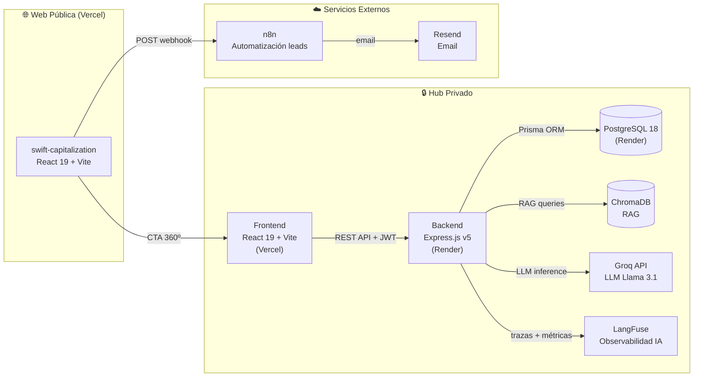
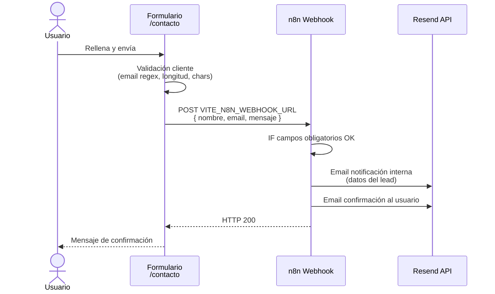
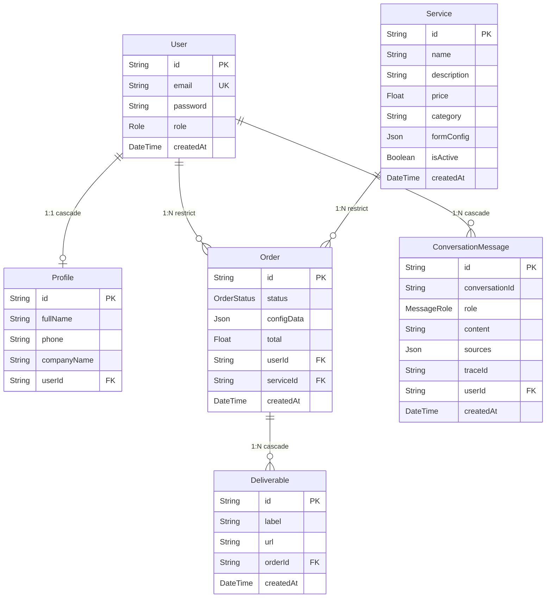
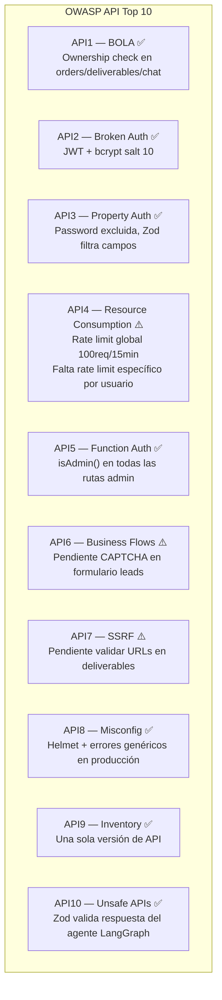
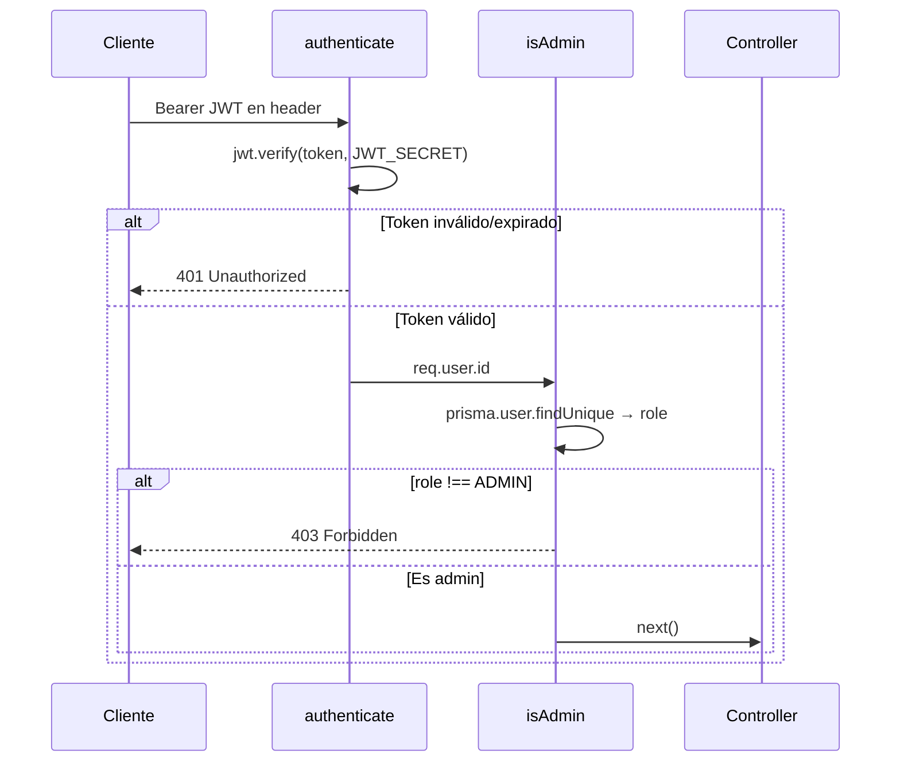
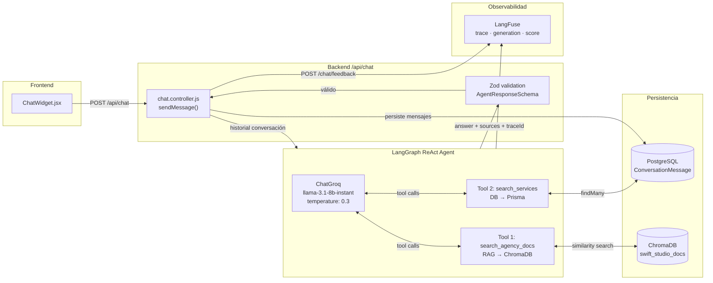
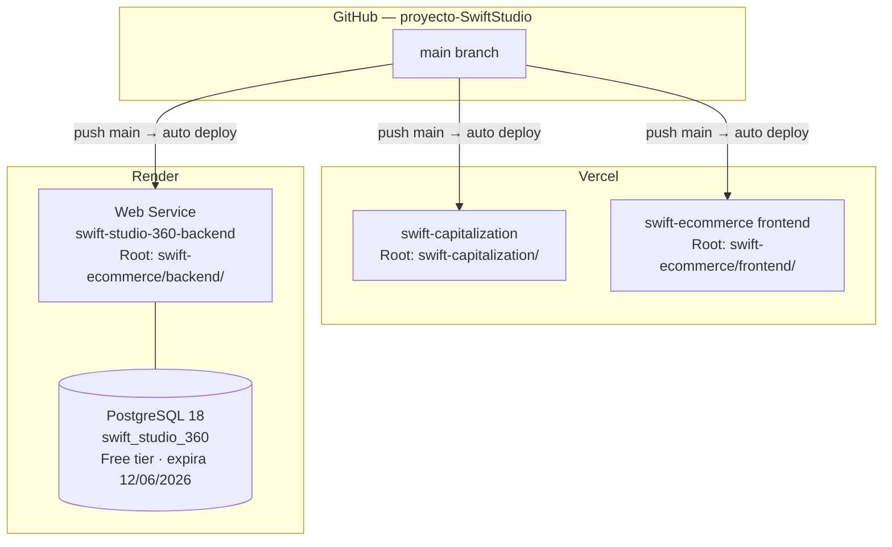

# Swift Studio — Documentación Técnica del Ecosistema

> Proyecto final Ironhack · Deadline: 15 junio 2026  
> Repositorio: `proyecto-SwiftStudio` · Autor: Sindy138

---

## 1. Visión General del Ecosistema

Swift Studio es una agencia de marketing digital y contenido audiovisual. Su ecosistema digital se compone de **dos aplicaciones complementarias** dentro del mismo repositorio monorepo:

| App                      | Repositorio path        | Dominio            | Propósito                                                     |
| ------------------------ | ----------------------- | ------------------ | ------------------------------------------------------------- |
| **swift-capitalization** | `swift-capitalization/` | swiftstudio.com    | Web pública: SEO, captación de leads, marketing               |
| **swift-ecommerce**      | `swift-ecommerce/`      | swiftstudio360.com | Hub privado: contratación de servicios, dashboard, chatbot IA |



---

## 2. swift-capitalization — Web de Captación

### 2.1 Stack Técnico

| Tecnología         | Versión | Rol                            |
| ------------------ | ------- | ------------------------------ |
| React              | 19.x    | Framework UI                   |
| React Router       | 7.x     | Routing SPA                    |
| Vite               | 8.x     | Build tool + dev server        |
| react-helmet-async | 3.x     | SEO meta tags por página       |
| DOMPurify          | 3.x     | Sanitización HTML (blog/CMS)   |
| marked             | 18.x    | Renderizado Markdown           |
| n8n                | externo | Procesamiento formulario leads |

### 2.2 Arquitectura

El proyecto es **data-driven**: todo el contenido textual vive en un único archivo de configuración. Los componentes son agnósticos al sector — cambiar `content.js` cambia toda la web.

```
swift-capitalization/src/
├── config/
│   ├── content.js          ← FUENTE DE VERDAD de todo el contenido
│   └── TEMPLATE.js         ← Plantilla reutilizable para otros sectores
├── components/
│   ├── home/               ← HeroSection, SocialProof, ServiceGrid, EngineSection, SEOAuthority
│   └── layout/
│       ├── NavBar.jsx       ← Botón 360º apunta a VITE_HUB_URL
│       └── Footer.jsx
└── App.jsx
```

### 2.3 SEO — Implementación Técnica

El SEO es el objetivo central de esta plataforma. Implementaciones activas:

- **react-helmet-async** — `title`, `description` y Open Graph únicos por ruta
- **JSON-LD estructurado** — `LocalBusiness` en Home, `BlogPosting` en artículos, `Service` en páginas de servicio
- **Core Web Vitals** — lazy loading de imágenes, sin layout shifts, optimización LCP
- **`clamp()` estricto** — solo en `font-size`, `gap` y logo (evita layout shifts en CLS)
- **React Router `<Link>`** — navegación interna sin recarga de página

### 2.4 Variables de Entorno

Archivo: `swift-capitalization/.env`

```env
VITE_N8N_WEBHOOK_URL=https://tu-instancia-n8n.com/webhook/leads
VITE_HUB_URL=https://swiftstudio360.vercel.app
```

> La API key de Resend **nunca** va en este `.env` — va en n8n como credencial de servidor.

### 2.5 Integración n8n — Formulario de Leads

Flujo completo del formulario de contacto (`/contacto`):



Archivo de envío: `swift-capitalization/src/pages/Contacto/ContactoPage.jsx`

---

## 3. swift-ecommerce — Hub Privado

### 3.1 Stack Técnico

#### Backend

| Tecnología                         | Versión | Rol                                  |
| ---------------------------------- | ------- | ------------------------------------ |
| Node.js                            | LTS     | Runtime                              |
| Express.js                         | v5      | Framework HTTP                       |
| PostgreSQL                         | 18      | Base de datos relacional             |
| Prisma ORM                         | v7.8    | ORM + migraciones                    |
| `@prisma/adapter-pg`               | v7.8    | Driver adapter (Prisma 7)            |
| JWT (jsonwebtoken)                 | 9.x     | Autenticación stateless (7d)         |
| bcryptjs                           | 3.x     | Hash de contraseñas (salt 10)        |
| Zod                                | 4.x     | Validación de inputs                 |
| Helmet                             | 8.x     | Headers de seguridad HTTP            |
| express-rate-limit                 | 8.x     | Rate limiting global (100 req/15min) |
| morgan                             | 1.x     | HTTP request logger                  |
| LangGraph                          | 1.3     | Orquestación del agente IA           |
| LangChain Groq                     | 1.2     | Integración LLM Groq                 |
| ChromaDB                           | 3.4     | Vector DB para RAG                   |
| LangFuse                           | 3.38    | Observabilidad LLM                   |
| swagger-jsdoc + swagger-ui-express | —       | Documentación API (solo dev)         |
| Vitest + Supertest                 | —       | Tests de integración                 |

#### Frontend

| Tecnología   | Versión | Rol                                |
| ------------ | ------- | ---------------------------------- |
| React        | 19.x    | Framework UI                       |
| React Router | 7.x     | Routing + rutas protegidas         |
| Vite         | 8.x     | Build tool                         |
| Axios        | 1.x     | Cliente HTTP con interceptores JWT |
| DOMPurify    | 3.x     | Sanitización mensajes del chatbot  |
| Context API  | —       | Estado global de autenticación     |

### 3.2 Arquitectura de Carpetas — Backend

```
swift-ecommerce/backend/
├── prisma/
│   ├── schema.prisma           ← Modelos: User, Profile, Service, Order, Deliverable, ConversationMessage
│   ├── prisma.config.ts        ← Config Prisma 7: datasource.url para migrate deploy
│   ├── seed.js                 ← 8 servicios iniciales con formConfig dinámico
│   └── migrations/
│       ├── 20260511_init/
│       ├── 20260512_add_is_active_to_service/
│       └── 20260608_add_chat/  ← Tabla ConversationMessage
├── src/
│   ├── server.js               ← Entry point, PORT desde env
│   ├── app.js                  ← Express: middlewares, rutas, SPA fallback
│   ├── features/
│   │   ├── auth/               ← register, login (JWT)
│   │   ├── users/              ← CRUD usuarios + perfil
│   │   ├── services/           ← Catálogo servicios (CRUD admin)
│   │   ├── orders/             ← Pedidos + deliverables
│   │   └── chat/
│   │       ├── chat.controller.js   ← sendMessage, getChatHistory, submitFeedback
│   │       ├── chat.schema.js       ← Zod: validación respuesta agente (API10)
│   │       ├── chat.routes.js
│   │       └── agent/
│   │           ├── agent.js         ← LangGraph ReAct agent + LangFuse tracing
│   │           └── tools.js         ← Tool 1: RAG (ChromaDB) · Tool 2: DB (Prisma)
│   ├── middlewares/
│   │   ├── auth.middleware.js        ← authenticate() + isAdmin()
│   │   ├── validate.middleware.js    ← validate(schema) → 400
│   │   └── error.middleware.js       ← Prisma errors → HTTP codes
│   ├── lib/
│   │   ├── prisma.js                 ← Singleton PrismaClient con PrismaPg adapter
│   │   ├── chroma.js                 ← ChromaDB client singleton
│   │   ├── langfuse.js               ← LangFuse client singleton (lazy init)
│   │   └── asyncHandler.js           ← Wrapper async para controllers
│   └── config/
│       └── swagger.js                ← Spec OpenAPI (solo entorno dev)
```

### 3.3 Base de Datos — Esquema



**Enums:**

- `Role`: `USER` | `ADMIN`
- `OrderStatus`: `PENDING` | `PROGRESS` | `DONE`
- `MessageRole`: `USER` | `ASSISTANT`

### 3.4 API REST — Endpoints

Base URL: `https://swift-studio-360-backend.onrender.com/api`  
Autenticación: `Authorization: Bearer <JWT>`

| Módulo       | Método          | Ruta                            | Acceso                         |
| ------------ | --------------- | ------------------------------- | ------------------------------ |
| Auth         | POST            | `/auth/register`                | Pública                        |
| Auth         | POST            | `/auth/login`                   | Pública                        |
| Services     | GET             | `/services`                     | Pública                        |
| Services     | GET             | `/services/:id`                 | Pública                        |
| Services     | POST/PUT/DELETE | `/services`                     | Admin                          |
| Orders       | POST            | `/orders`                       | Auth                           |
| Orders       | GET             | `/orders`                       | Auth (propias) / Admin (todas) |
| Orders       | GET             | `/orders/:id`                   | Auth (owner) / Admin           |
| Orders       | PUT             | `/orders/:id/status`            | Admin                          |
| Deliverables | POST/GET        | `/orders/:id/deliverables`      | Admin / Owner                  |
| Users        | GET             | `/users`                        | Admin                          |
| Users        | GET/PUT         | `/users/:id`                    | Self / Admin                   |
| Users        | DELETE          | `/users/:id`                    | Admin                          |
| Chat         | POST            | `/chat`                         | Auth                           |
| Chat         | GET             | `/chat/history/:conversationId` | Auth (owner)                   |
| Chat         | POST            | `/chat/feedback/:traceId`       | Auth                           |

---

## 4. Seguridad

### 4.1 OWASP API Top 10 — Estado de Implementación



### 4.2 Autenticación y Autorización

**Archivo:** `swift-ecommerce/backend/src/middlewares/auth.middleware.js`

- **JWT** con expiración de 7 días — verificado en cada request protegido
- **RBAC** de dos niveles: `USER` y `ADMIN`
- `authenticate()` — extrae y verifica el Bearer token
- `isAdmin()` — consulta la DB para verificar el rol (no se fía del payload del token)
- En el frontend, `AuthContext.jsx` gestiona el estado global y `ProtectedRoute.jsx` bloquea rutas privadas



### 4.3 Validación de Inputs

**Archivo:** `swift-ecommerce/backend/src/middlewares/validate.middleware.js`

- Todos los endpoints de escritura tienen un schema Zod asociado (`*.schema.js` por feature)
- El middleware `validate(schema)` rechaza con `400` cualquier body que no cumpla el schema
- Las respuestas del agente IA también se validan con Zod antes de persistirse (`chat.schema.js` — API10)

### 4.4 Seguridad del Agente IA — Prompt Injection

**Archivo:** `swift-ecommerce/backend/src/features/chat/agent/agent.js`

El system prompt incluye reglas explícitas anti-jailbreak:

- Rechazo explícito a instrucciones de cambio de rol
- Nunca revela el contenido del system prompt
- Ignora instrucciones embebidas en el contexto del RAG (prompt injection indirecto)
- No ejecuta código ni accede a URLs externas
- Respuesta normalizada ante cualquier intento de manipulación

### 4.5 Gestión de Secretos

- Todos los secretos en variables de entorno, nunca hardcodeados
- `.env` en `.gitignore` en ambos proyectos
- La API key de Resend vive en n8n (servidor), nunca en el frontend
- `GROQ_API_KEY`, `LANGFUSE_*`, `JWT_SECRET`, `DATABASE_URL` solo en Render

### 4.6 Headers de Seguridad HTTP

**Archivo:** `swift-ecommerce/backend/src/app.js`

- **Helmet** activo en producción: `X-Frame-Options`, `X-Content-Type-Options`, `Strict-Transport-Security`, `Content-Security-Policy`
- **CORS** restringido a `CORS_ORIGIN` (env var) — en producción rechaza cualquier origen no autorizado
- **morgan** en modo `combined` en producción (logs de acceso completos)

---

## 5. Sistema de IA — LLM + RAG

### 5.1 Arquitectura del Agente



### 5.2 LangGraph — Agente ReAct

**Archivo:** `swift-ecommerce/backend/src/features/chat/agent/agent.js`

- Tipo: **ReAct** (`createReactAgent` de `@langchain/langgraph/prebuilt`)
- LLM: **Groq** (`llama-3.1-8b-instant`, temperatura 0.3)
- Historial de contexto: últimos **10 turnos** de conversación
- 2 tools disponibles (requisito BRIEF):
  - `search_agency_docs` — recupera contexto del RAG
  - `search_services` — consulta servicios y precios en la BD

### 5.3 RAG — Retrieval Augmented Generation

**Archivo:** `swift-ecommerce/backend/src/lib/chroma.js`  
**Archivo:** `swift-ecommerce/backend/src/features/chat/agent/tools.js`

- **Vector DB:** ChromaDB — colección `swift_studio_docs`
- **Embedding:** `@chroma-core/default-embed` (DefaultEmbeddingFunction)
- **Búsqueda:** `queryTexts` → top 3 resultados por similitud semántica
- Las fuentes citadas se extraen de los metadatos y se devuelven al frontend junto con la respuesta
- La tool está envuelta en try/catch — si ChromaDB no está disponible, devuelve un mensaje gracioso sin crashear el servidor

### 5.4 LangFuse — Observabilidad LLM

**Archivo:** `swift-ecommerce/backend/src/lib/langfuse.js`

Inicialización lazy — si no hay claves configuradas, retorna `null` (no bloquea el servidor).

| Evento trazado               | Qué registra                                  |
| ---------------------------- | --------------------------------------------- |
| `trace: 'chat-agent'`        | userId, mensaje de entrada                    |
| `generation: 'agent-invoke'` | model, input, output, tokens (input/output)   |
| `trace.update`               | respuesta final + fuentes citadas             |
| `score: 'user-feedback'`     | 👍 (1) / 👎 (0) por traceId desde el frontend |

Dashboard: `cloud.langfuse.com`

---

## 6. Automatizaciones — n8n

### 6.1 Flujo de Leads (swift-capitalization)

**Trigger:** Webhook POST desde el formulario `/contacto`

```
Webhook → IF validación → Resend (email equipo) → Resend (email lead) → [CRM opcional] → HTTP 200
```

Variables involucradas:

- `swift-capitalization/.env` → `VITE_N8N_WEBHOOK_URL`
- Credencial Resend configurada en n8n (no expuesta al frontend)

### 6.2 Automatizaciones de Servicios (swift-ecommerce)

Los servicios de automatización que ofrece la agencia usan n8n como motor:

- **Integración CRM + Email Marketing** — sincronización de contactos entre plataformas
- **Automatización de Facturación** — Stripe → software contable

Seed: `swift-ecommerce/backend/prisma/seed.js`

---

## 7. Despliegue



### 7.1 Build Commands

| Servicio                          | Build Command                                                     | Start Command |
| --------------------------------- | ----------------------------------------------------------------- | ------------- |
| swift-capitalization (Vercel)     | `npm run build`                                                   | —             |
| swift-ecommerce frontend (Vercel) | `npm run build`                                                   | —             |
| swift-ecommerce backend (Render)  | `npm install && npx prisma generate && npx prisma migrate deploy` | `npm start`   |

### 7.2 Variables de Entorno — Backend (Render)

| Variable              | Descripción                          |
| --------------------- | ------------------------------------ |
| `DATABASE_URL`        | Internal URL de PostgreSQL en Render |
| `JWT_SECRET`          | Mínimo 32 caracteres aleatorios      |
| `NODE_ENV`            | `production`                         |
| `CORS_ORIGIN`         | URL del frontend ecommerce en Vercel |
| `GROQ_API_KEY`        | API key de console.groq.com          |
| `GROQ_MODEL`          | `llama-3.1-8b-instant`               |
| `LANGFUSE_SECRET_KEY` | De cloud.langfuse.com                |
| `LANGFUSE_PUBLIC_KEY` | De cloud.langfuse.com                |
| `LANGFUSE_HOST`       | `https://cloud.langfuse.com`         |
| `CHROMA_HOST`         | Host de ChromaDB                     |
| `CHROMA_PORT`         | `8000`                               |

### 7.3 Variables de Entorno — Frontend Ecommerce (Vercel)

| Variable       | Descripción                                     |
| -------------- | ----------------------------------------------- |
| `VITE_API_URL` | URL del backend en Render (sin `/api` al final) |

### 7.4 Variables de Entorno — Capitalización (Vercel)

| Variable               | Descripción                    |
| ---------------------- | ------------------------------ |
| `VITE_N8N_WEBHOOK_URL` | URL del webhook n8n para leads |
| `VITE_HUB_URL`         | URL del frontend ecommerce     |

---

## 8. Tests

**Directorio:** `swift-ecommerce/backend/` — ejecutar con `npm test`

- **Framework:** Vitest + Supertest
- **Tipo:** Tests de integración (10 tests) — golpean el servidor real con DB de test
- **Cobertura:** Auth (register/login), Services (CRUD), Orders (creación, ownership), Users

> Los tests de integración usan una instancia real de la DB — no hay mocks de base de datos por decisión de diseño (los mocks ocultaron bugs en migración anteriormente).

---

## 9. Checklist del BRIEF

- [x] Backend funcional con JWT + PostgreSQL
- [x] LangGraph agent (2 tools: RAG + DB)
- [x] RAG con ChromaDB (colección `swift_studio_docs`, cita fuentes)
- [ ] N8N workflow activo con lógica condicional _(pendiente fase 7)_
- [x] POST /api/chat + GET /api/chat/history/:conversationId
- [x] Frontend React 19 + Vite + Router v7
- [x] Chat widget IA en el frontend
- [x] Context API para estado global (AuthContext)
- [x] Formularios con validación cliente
- [x] Diseño responsive
- [x] Backend desplegado (Render)
- [x] Frontend desplegado (Vercel)
- [x] BD en la nube (Render PostgreSQL)
- [ ] Swagger / documentación API _(disponible en dev: `/api/docs`)_
- [ ] README completo _(pendiente)_
- [ ] ai*log.md *(pendiente)\_
- [ ] Workflows N8N exportados como JSON _(pendiente)_
- [ ] Presentación ≤10 min con demo en vivo
