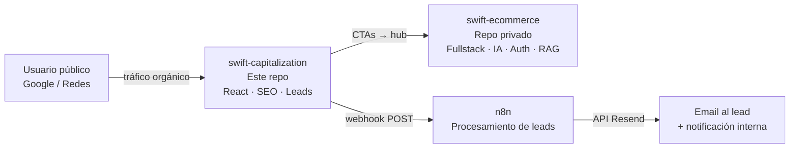
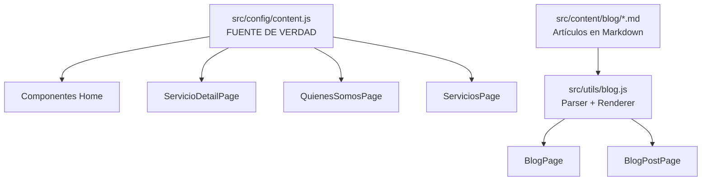
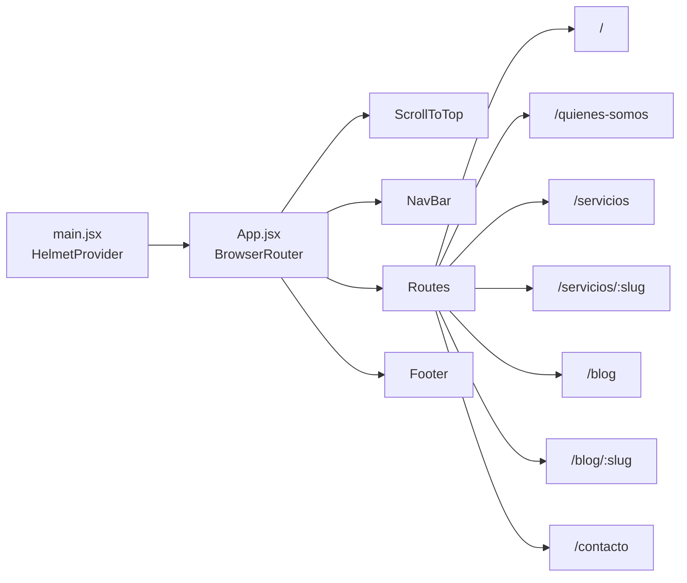
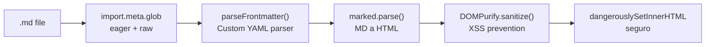
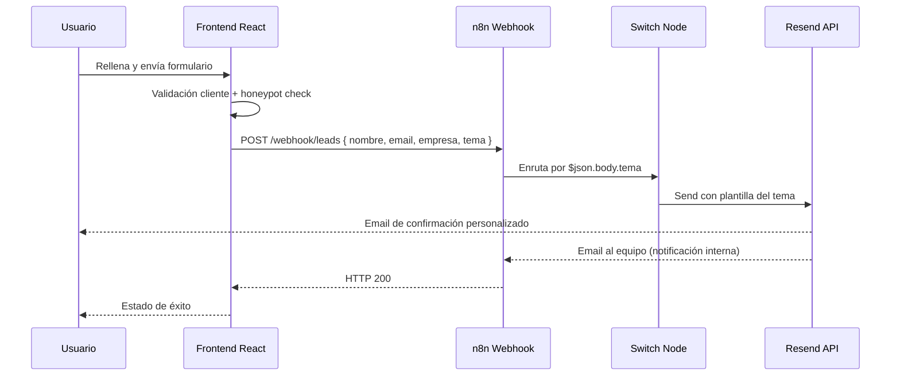
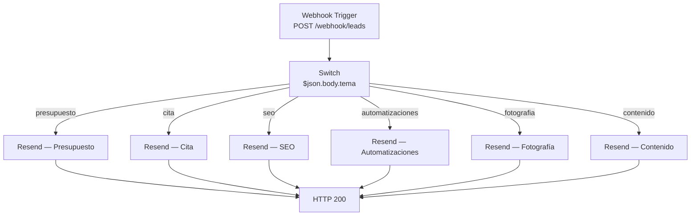
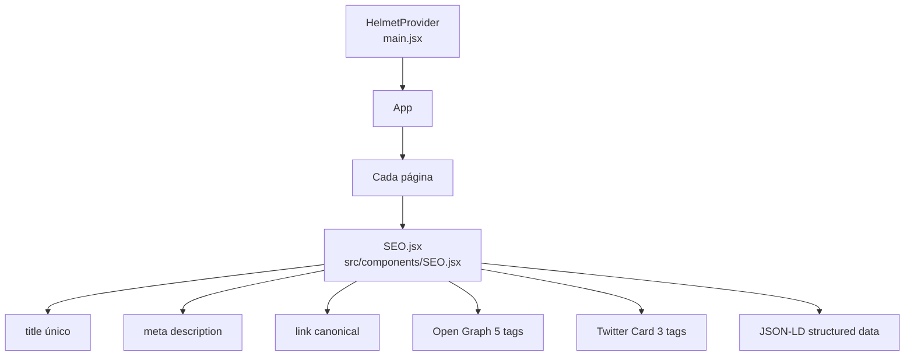

# Swift Studio — Plataforma de Capitalización y SEO

Web de marketing 100% pública construida en **React 19 + Vite 8**. Motor de captación de leads del ecosistema Swift Studio: optimizada para Core Web Vitals, posicionamiento orgánico y conversión.

---

## Ecosistema



> `swift-capitalization` es exclusivamente frontend estático. No contiene backend, autenticación, base de datos ni lógica de e-commerce.

---

## Stack Técnico

| Tecnología         | Versión | Rol                                |
| ------------------ | ------- | ---------------------------------- |
| React              | 19.x    | Framework principal                |
| React Router       | 7.x     | Routing SPA                        |
| Vite               | 8.x     | Build tool + dev server            |
| react-helmet-async | latest  | Meta tags y JSON-LD en `<head>`    |
| react-icons        | latest  | Sistema de iconos (Feather Icons)  |
| marked             | 18.x    | Markdown → HTML para el blog       |
| dompurify          | 3.x     | Sanitización de HTML renderizado   |
| n8n                | externo | Procesamiento de leads vía webhook |
| Resend             | externo | Envío de emails transaccionales    |

---

## Arquitectura

### Principio data-driven

Todo el contenido textual vive en un único archivo de configuración. Los componentes son agnósticos al sector y reciben datos por props.



Cambiar `content.js` cambia toda la web. La arquitectura está diseñada para que una segunda instancia (ej. Inmobiliaria) requiera únicamente cambiar ese archivo.

### Estructura de carpetas

```
swift-capitalization/
├── public/
│   ├── sitemap.xml
│   ├── robots.txt
│   ├── favicon.svg
│   └── logos/
├── src/
│   ├── components/
│   │   ├── SEO.jsx              ← Componente SEO global
│   │   ├── ScrollToTop.jsx      ← Reset de scroll en navegación SPA
│   │   ├── home/
│   │   │   ├── Home.jsx
│   │   │   ├── HeroSection.jsx
│   │   │   ├── SocialProof.jsx
│   │   │   ├── ServiceGrid.jsx
│   │   │   ├── EngineSection.jsx
│   │   │   └── SEOAuthority.jsx
│   │   └── layout/
│   │       ├── NavBar.jsx
│   │       └── Footer.jsx
│   ├── config/
│   │   ├── content.js           ← Config maestra del sector
│   │   └── TEMPLATE.js          ← Plantilla para nuevos sectores
│   ├── content/
│   │   └── blog/
│   │       ├── seo-tecnico-guia-2025.md
│   │       ├── fotografia-producto-ecommerce.md
│   │       └── flujos-automatizacion-n8n.md
│   ├── hooks/
│   │   └── useInView.js         ← IntersectionObserver para animaciones
│   ├── pages/
│   │   ├── HomePage.jsx
│   │   ├── QuienesSomosPage.jsx
│   │   ├── ServiciosPage.jsx
│   │   ├── ServicioDetailPage.jsx
│   │   ├── BlogPage.jsx
│   │   ├── BlogPostPage.jsx
│   │   ├── ContactoPage.jsx
│   │   └── styles/              ← CSS Modules por página
│   ├── utils/
│   │   └── blog.js              ← Carga y parseo de artículos markdown
│   ├── App.jsx
│   └── main.jsx                 ← HelmetProvider root
├── .env                         ← Variables de entorno (no en git)
├── .env.example
└── index.html
```

---

## Páginas implementadas

| Ruta               | Página                   | Estado     |
| ------------------ | ------------------------ | ---------- |
| `/`                | Home                     | Completada |
| `/quienes-somos`   | The Origin               | Completada |
| `/servicios`       | Listado de servicios     | Completada |
| `/servicios/:slug` | Detalle de servicio (×5) | Completada |
| `/blog`            | Blog SEO Engine          | Completada |
| `/blog/:slug`      | Artículo individual      | Completada |
| `/contacto`        | Formulario de leads      | Completada |

---

## Sistema de Diseño

### Paleta de colores

```css
/* Gradiente de marca — CTAs, hovers, acentos */
--gradient-brand: linear-gradient(90deg, #ffae8e, #ff7da2, #aa73fa);

/* Bases */
--color-base: #202020; /* fondo dark (secciones oscuras) */
--color-dark: #2c3e50; /* azul oscuro */
--color-bg: #ffffff; /* fondo general */
```

### Regla de `clamp()`

`clamp()` se aplica **exclusivamente** a tres propiedades:

```css
/* OBLIGATORIO con clamp */
font-size: clamp(1rem, 2.5vw, 1.25rem);
gap: clamp(1rem, 3vw, 2rem);
width: clamp(150px, 20vw, 280px); /* solo logo */

/* TODO LO DEMÁS — valores fijos */
padding: 1.5rem 2rem;
border-radius: 3px;
max-width: 1500px;
```

### Efectos visuales

| Efecto             | Implementación                                                                       |
| ------------------ | ------------------------------------------------------------------------------------ |
| Glassmorphism      | `background: rgba(255,255,255,0.11)` + `backdrop-filter: blur(1px)`                  |
| Dotted pattern     | `radial-gradient(rgba(255,255,255,0.1) 1px, transparent 1px)` en `::before`          |
| Gradiente en texto | `background: var(--gradient-brand)` + `background-clip: text` + `color: transparent` |
| Microanimaciones   | `opacity: 0 → 1` + `translateY(24px → 0)` via `IntersectionObserver`                 |

### Hook `useInView`

```js
const useInView = (options) => {
  const ref = useRef(null);
  const [inView, setInView] = useState(false);

  useEffect(() => {
    const observer = new IntersectionObserver(([entry]) => {
      if (entry.isIntersecting) {
        setInView(true);
        observer.disconnect(); // dispara una sola vez
      }
    }, options);
    if (ref.current) observer.observe(ref.current);
    return () => observer.disconnect();
  }, []);

  return [ref, inView];
};
```

---

## Routing y Navegación



**`ScrollToTop`** resuelve el problema inherente de React Router donde el scroll no se resetea al navegar entre páginas en una SPA:

```jsx
const ScrollToTop = () => {
  const { pathname } = useLocation();
  useEffect(() => {
    window.scrollTo(0, 0);
  }, [pathname]);
  return null;
};
```

---

## Blog SEO Engine

### Carga de artículos con Vite

Los artículos son archivos `.md` en `src/content/blog/`. Vite los carga en tiempo de build como strings raw:

```js
const RAW_FILES = import.meta.glob("/src/content/blog/*.md", {
  eager: true,
  query: "?raw",
  import: "default",
});
```

> `as: 'raw'` está deprecado en Vite 5+. La sintaxis correcta es `query: '?raw', import: 'default'`.

### Pipeline de procesamiento



### Frontmatter de artículos

```markdown
---
title: "Título del artículo"
slug: slug-del-articulo
category: Estrategia | Visual | Automate
date: 2025-03-10
excerpt: "Resumen para listado y meta description"
readTime: 8
author: Swift Studio
---
```

### Estilos de prosa con CSS Modules

Para aplicar estilos al HTML generado por `marked` dentro de un CSS Module, se usa `:global()`:

```css
.articleBody :global(h2) {
  font-size: clamp(1.25rem, 2.2vw, 1.75rem);
}
.articleBody :global(p) {
  line-height: 1.8;
}
.articleBody :global(a) {
  color: #aa73fa;
}
```

---

## Formulario de Contacto y Automatización

### Flujo completo



### Seguridad del formulario

#### Validación en cliente

```js
// Email RFC 5322
const EMAIL_RE =
  /^[a-zA-Z0-9.!#$%&'*+/=?^_`{|}~-]+@[a-zA-Z0-9](?:[a-zA-Z0-9-]{0,61}[a-zA-Z0-9])?(?:\.[a-zA-Z0-9](?:[a-zA-Z0-9-]{0,61}[a-zA-Z0-9])?)*\.[a-zA-Z]{2,}$/;

// Nombre — solo letras, espacios, tildes, guiones
const NOMBRE_RE = /^[a-zA-ZÀ-ÿ\s'\-]+$/;

// Whitelist de temas — previene valores manipulados desde DevTools
const ALLOWED_TEMAS = new Set(TEMAS.map((t) => t.value));
```

| Campo   | Regla                                               |
| ------- | --------------------------------------------------- |
| Nombre  | Regex letras + tildes, 2–100 chars                  |
| Email   | Regex RFC-compliant, máx 254 chars                  |
| Empresa | Opcional, máx 100 chars                             |
| Tema    | Whitelist con `Set`, rechaza valores no registrados |

#### Sanitización antes del envío

```js
const sanitize = (str) =>
  str
    .trim()
    .replace(/[<>"'`]/g, "")
    .slice(0, 500);
```

#### Honeypot anti-bot

```jsx
<div className={styles.honeypot} aria-hidden="true">
  <input type="text" name="website" tabIndex="-1" autoComplete="off" />
</div>
```

```css
.honeypot {
  position: absolute;
  left: -9999px;
  opacity: 0;
  pointer-events: none;
}
```

Si el campo `website` tiene valor → bot detectado → se finge éxito sin enviar al webhook.

#### Protección doble envío

```js
const submitRef = useRef(false);

const handleSubmit = async (e) => {
  if (submitRef.current) return;
  submitRef.current = true;
  // se resetea solo en caso de error de red
};
```

`useRef` en lugar de `useState` para evitar re-renders durante el submit.

### Configuración n8n

#### Estructura del workflow



**Puntos críticos de configuración:**

- La condición del Switch usa `{{ $json.body.tema }}` — el body del webhook llega anidado bajo `.body`
- El campo Subject del nodo Resend se deja vacío cuando se usa template — Resend usa el del template
- Variables en plantilla Resend con triple llave: `{{{nombre}}}` (Handlebars sin escapar HTML)
- Template Variables en n8n: clave `nombre` → valor `{{ $json.body.nombre }}`

#### API key de Resend

La API key **no va en el `.env` de este repo**. Va en n8n como credencial de servidor:

```
n8n → Credentials → New → "Resend" → pegar re_xxxxxxxxx
```

Exponerla con prefijo `VITE_` la expondría al navegador — vulnerabilidad crítica.

---

## SEO — Implementación Técnica

### Arquitectura de meta tags



### Componente SEO

```jsx
const SEO = ({ title, description, canonical, ogType = "website", jsonLd }) => {
  const fullTitle = title ? `${title} | Swift Studio` : "Swift Studio — ...";
  const url = canonical ? `${SITE}${canonical}` : SITE;

  return (
    <Helmet>
      <title>{fullTitle}</title>
      <meta name="description" content={description} />
      <link rel="canonical" href={url} />
      <meta property="og:title" content={fullTitle} />
      <meta property="og:description" content={description} />
      <meta property="og:url" content={url} />
      <meta property="og:type" content={ogType} />
      <meta property="og:site_name" content="Swift Studio" />
      <meta name="twitter:card" content="summary_large_image" />
      {jsonLd && (
        <script type="application/ld+json">{JSON.stringify(jsonLd)}</script>
      )}
    </Helmet>
  );
};
```

### Structured Data JSON-LD por página

| Página          | Schema.org Type | Campos clave                                            |
| --------------- | --------------- | ------------------------------------------------------- |
| Home            | `LocalBusiness` | name, description, url, address, aggregateRating        |
| Quiénes Somos   | `AboutPage`     | name, description, url                                  |
| Servicio detail | `Service`       | name, description, provider, url                        |
| Blog post       | `BlogPosting`   | headline, description, author, datePublished, publisher |

### Sitemap y Robots

**`public/sitemap.xml`** — 13 URLs con `priority` y `changefreq` diferenciados:

| Tipo                         | Priority | Changefreq       |
| ---------------------------- | -------- | ---------------- |
| Home                         | 1.0      | weekly           |
| Servicios listing, Blog      | 0.9      | monthly / weekly |
| Service pages, Quiénes Somos | 0.8      | monthly          |
| Blog posts, Contacto         | 0.7      | monthly          |

**`public/robots.txt`:**

```
User-agent: *
Allow: /

Sitemap: https://swiftstudio.com/sitemap.xml
```

---

## Variables de Entorno

```bash
# .env — nunca subir al repositorio
VITE_N8N_WEBHOOK_URL=https://tu-instancia-n8n.com/webhook/leads
VITE_HUB_URL=https://ecommerce.swiftstudio.com
```

El prefijo `VITE_` es obligatorio para que Vite exponga la variable al cliente. Se accede como `import.meta.env.VITE_*`.

---

## Comandos

```bash
npm run dev      # Dev server en http://localhost:5173
npm run build    # Build de producción → /dist
npm run preview  # Preview del build
npm run lint     # ESLint
```

---

## Despliegue

Plataforma objetivo: **Vercel** (frontend estático).

### Redirects SPA requeridos

```json
// Vercel — vercel.json
{
  "rewrites": [{ "source": "/(.*)", "destination": "/index.html" }]
}
```

### URL Deploy

- [Demo](https://swift-studio-ecosystem.vercel.app/)

---

## Fases del Proyecto

```mermaid
gantt
    title Roadmap de implementación
    dateFormat X
    axisFormat %s
    section Setup
    Fase 0 Setup y estructura        :done, 0, 1
    Fase 1 NavBar responsive          :done, 1, 2
    section Home
    Fase 2.1 HeroSection              :done, 2, 3
    Fase 2.2 SocialProof Ticker       :done, 3, 4
    Fase 2.3 Testimonials             :done, 4, 5
    Fase 2.5 EngineSection            :done, 5, 6
    Fase 2.6 SEOAuthority             :done, 6, 7
    section Páginas internas
    Fase 3 Footer                     :done, 7, 8
    Fase 4 Quiénes Somos              :done, 8, 9
    Fase 5 Service Pages x5           :done, 9, 11
    Fase 6 Blog SEO Engine            :done, 11, 13
    section Integración y SEO
    Fase 7 Contacto + n8n + Resend    :done, 13, 15
    Fase 8 SEO Global                 :done, 15, 16
    section Despliegue
    Fase 9 Deploy Netlify/Vercel      :active, 16, 17
```



---

## Documentación de IA

Este proyecto documenta el uso de IA en el desarrollo según los requisitos del bootcamp. El registro completo de sesiones, prompts, adaptaciones y aprendizajes está en [`ai_log.md`](./ai_log.md).

Herramienta utilizada: **Claude Code** (`claude-sonnet-4-6`) — CLI de Anthropic con acceso a herramientas de lectura, edición y ejecución de comandos en el entorno de desarrollo local.
