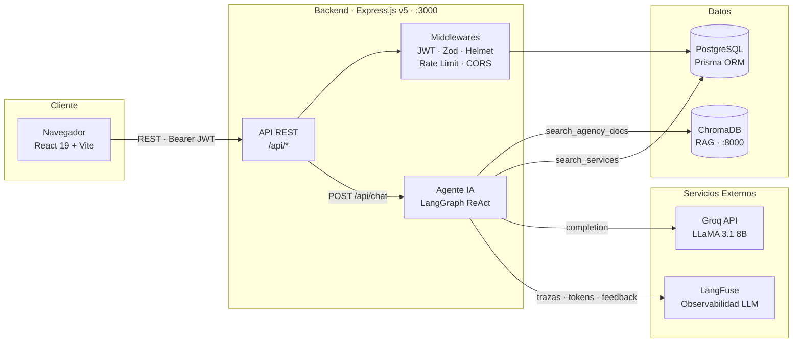
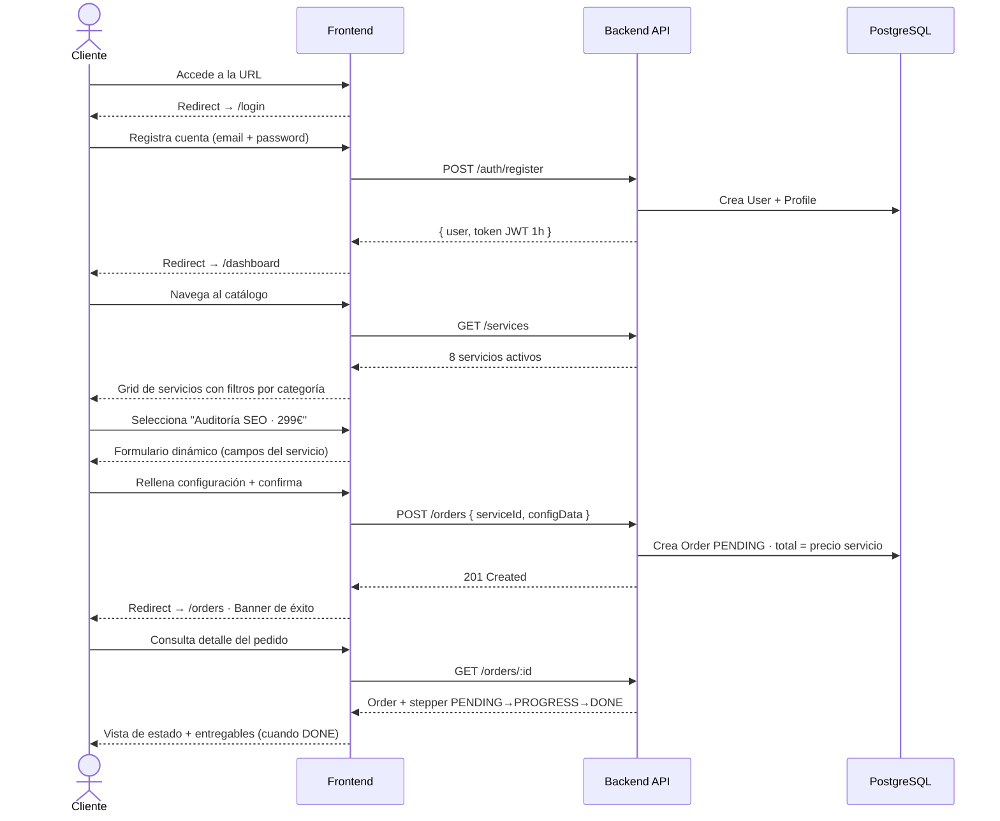
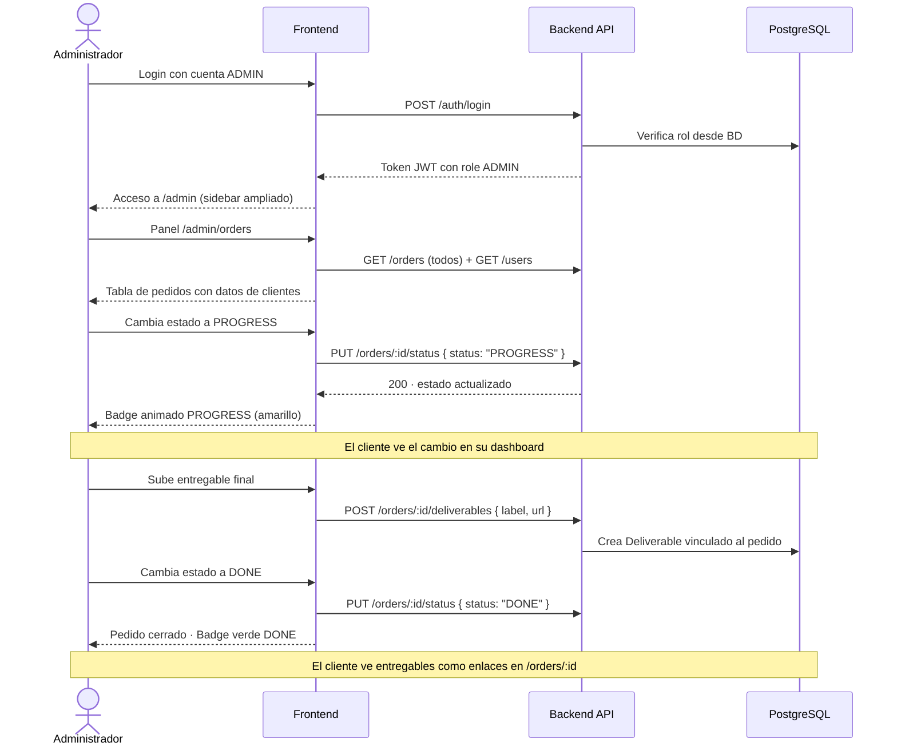
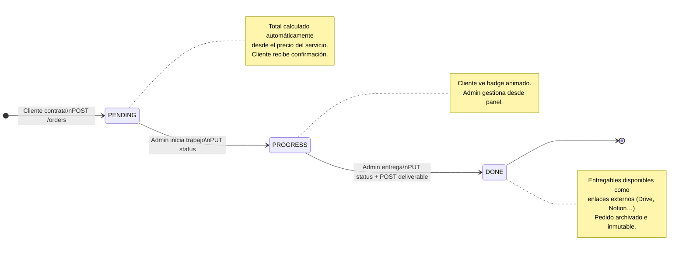
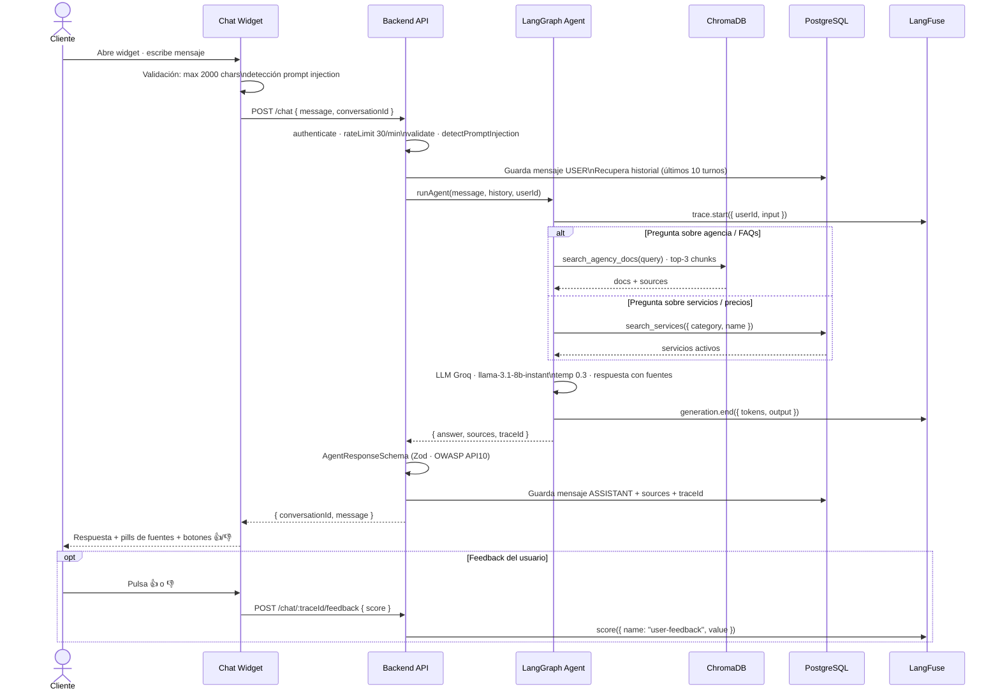
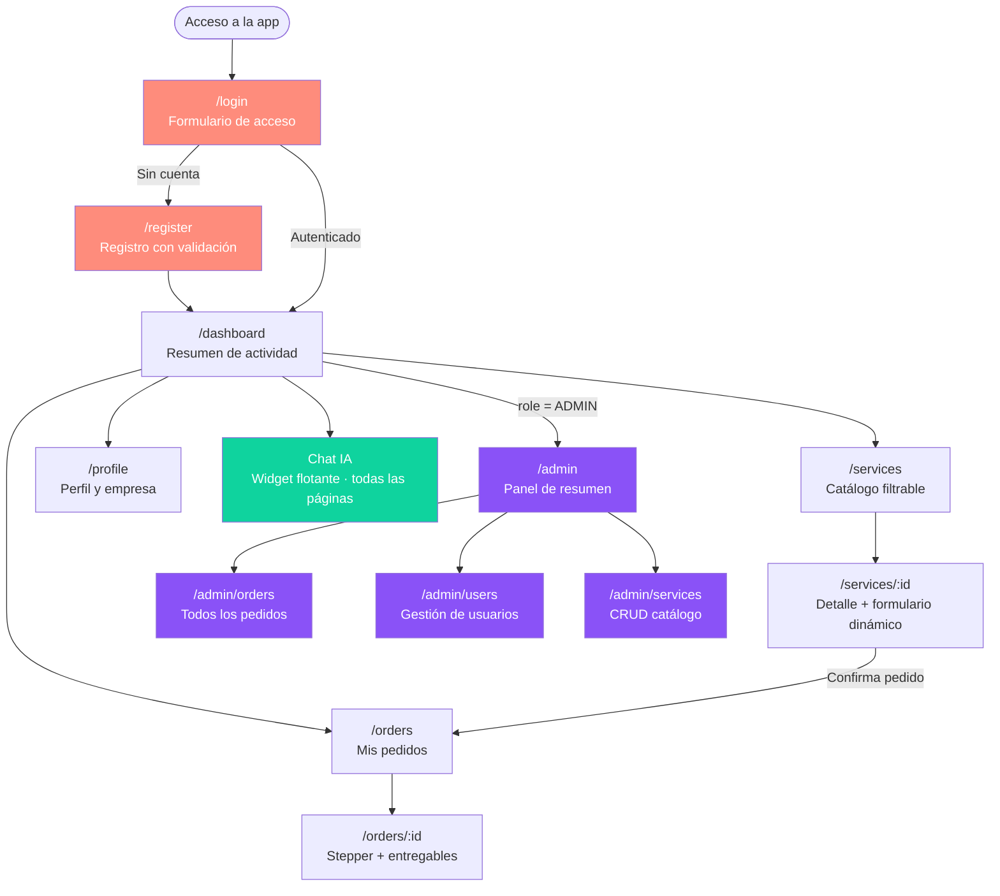
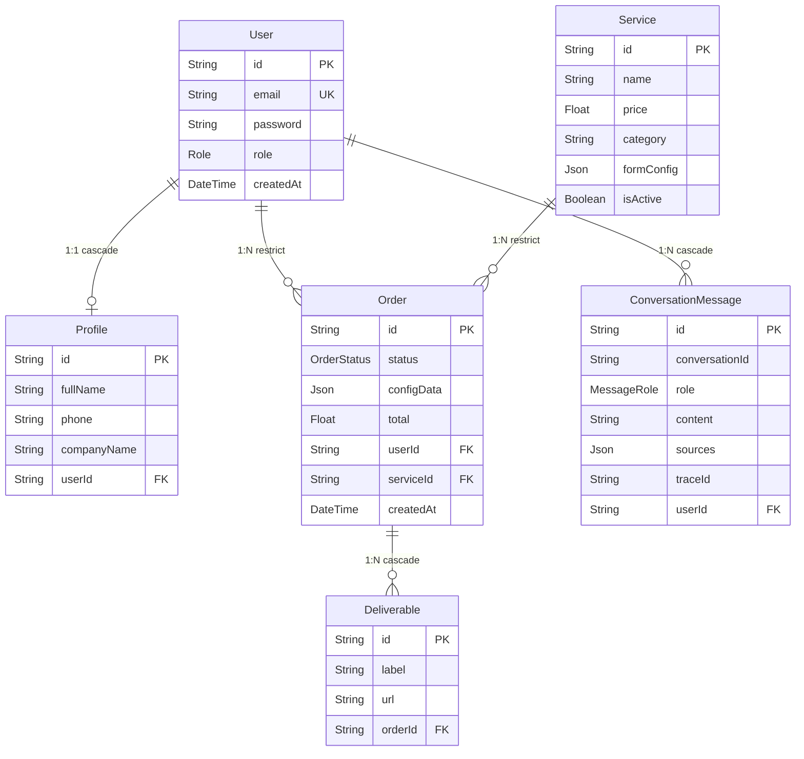

# Swift Studio 360

Plataforma B2B privada de contratación de servicios de marketing digital y contenido audiovisual. Los clientes acceden a un panel privado donde configuran y contratan servicios, hacen seguimiento de sus pedidos con un stepper visual, consultan entregables y conversan con un agente de IA especializado en los servicios de la agencia.

> Proyecto final del Bootcamp Ironhack · Fullstack + IA integrada · Deadline: 15 junio 2026

---

## ¿Qué es este producto?

Swift Studio 360 es un e-commerce de **servicios productizados**: el cliente no compra un producto físico, sino que contrata un servicio configurable (SEO, contenidos, fotografía, automatización) a través de un formulario dinámico que se adapta a cada tipo de servicio. Una vez contratado, el equipo de la agencia gestiona el pedido desde el panel de administración y publica los entregables finales directamente en el dashboard del cliente.

El agente IA actúa como consultor de ventas y soporte: responde preguntas sobre la agencia, los servicios y los precios con información en tiempo real desde la base de datos y documentación interna recuperada por RAG.

---

## Arquitectura del sistema



---

## Flujo del usuario (end-to-end)



---

## Flujo del administrador



---

## Ciclo de vida de un pedido



---

## Flujo del chatbot IA



---

## Mapa de navegación



---

## Stack tecnológico

### Backend

| Capa          | Tecnología                                               |
| ------------- | -------------------------------------------------------- |
| Framework     | Express.js v5 · Node.js v18+ (CommonJS)                  |
| Base de datos | PostgreSQL · Prisma ORM v7                               |
| Autenticación | JWT HS256 · TTL 1h · bcryptjs salt 10                    |
| Validación    | Zod (inputs + respuesta del LLM)                         |
| Seguridad     | Helmet · CORS estricto · express-rate-limit (6 limiters) |
| Testing       | Vitest · Supertest · 14 tests de integración             |

### Frontend

| Capa          | Tecnología                                           |
| ------------- | ---------------------------------------------------- |
| UI            | React 19 · Vite 8                                    |
| Routing       | React Router DOM v7 · lazy loading + Suspense        |
| Estado global | Context API (AuthContext)                            |
| HTTP          | Axios · interceptor JWT · redirect 401 automático    |
| Estilos       | CSS Modules + CSS Custom Properties (design tokens)  |
| Seguridad     | DOMPurify · ErrorBoundary · robots.txt `Disallow: /` |

### Inteligencia Artificial

| Componente     | Tecnología                          | Rol                                               |
| -------------- | ----------------------------------- | ------------------------------------------------- |
| Orquestación   | LangGraph `createReactAgent`        | Ciclo razonamiento → herramienta → respuesta      |
| LLM            | Groq API · LLaMA 3.1 8B Instant     | Generación de texto · temp 0.3                    |
| RAG            | ChromaDB · DefaultEmbeddingFunction | Recuperación de documentación interna             |
| Tool 1         | `search_agency_docs`                | Consulta ChromaDB — agencia, FAQs, portfolio      |
| Tool 2         | `search_services`                   | Consulta PostgreSQL — servicios y precios en vivo |
| Memoria        | PostgreSQL (`ConversationMessage`)  | Historial persistente entre sesiones              |
| Observabilidad | LangFuse                            | Trazas · tokens · coste · feedback 👍/👎          |

---

## Modelo de datos



---

## Seguridad — puntos clave

| Control          | Implementación                                                                          |
| ---------------- | --------------------------------------------------------------------------------------- |
| Autenticación    | JWT HS256 · TTL 1h · bcrypt salt 10                                                     |
| RBAC             | `isAdmin()` consulta BD en cada petición — sin caché de rol                             |
| Ownership        | Orders, deliverables y chat verifican `userId === req.user.id`                          |
| Inputs           | Zod en todos los endpoints · también valida respuesta del LLM (OWASP API10)             |
| XSS              | `dangerouslySetInnerHTML` prohibido · DOMPurify disponible · JSX escapa automáticamente |
| Prompt injection | 14 patrones regex backend + detección frontend + system prompt anti-jailbreak           |
| CORS             | Sin wildcard · `CORS_ORIGIN` obligatoria en producción · falla en startup si falta      |
| Rate limiting    | 6 limiters: global · login · register · chat · orders · users                           |
| Headers          | Helmet (X-Frame-Options, HSTS, nosniff, Referrer-Policy)                                |
| Privacidad       | `robots.txt Disallow: /` · `noindex, nofollow` · Swagger deshabilitado en producción    |
| Errores          | 5xx genéricos al cliente · detalles solo en logs de servidor                            |

---

## Puesta en marcha completa

**Requisitos previos:** Node.js v18+, PostgreSQL, ChromaDB en `:8000`.

### 1 — Backend

```bash
cd backend
cp .env.example .env      # configurar DATABASE_URL, JWT_SECRET, GROQ_API_KEY…
npm install
npx prisma generate
npx prisma migrate dev --name init
npx prisma db seed
npm run dev               # → http://localhost:3000
```

### 2 — Frontend

```bash
cd frontend
npm install
npm run dev               # → http://localhost:5173
```

El proxy de Vite redirige `/api/*` al backend automáticamente — no se necesita ninguna variable de entorno adicional en el frontend.

### 3 — Verificación end-to-end

| Paso | Acción                                | Resultado esperado                       |
| ---- | ------------------------------------- | ---------------------------------------- |
| 1    | Acceder a `localhost:5173`            | Redirect a `/login`                      |
| 2    | Registrar cuenta                      | Token JWT · redirect a `/dashboard`      |
| 3    | Navegar a `/services`                 | 8 servicios del catálogo                 |
| 4    | Contratar un servicio                 | Pedido en `/orders` · estado PENDING     |
| 5    | Abrir chat · preguntar por servicios  | Respuesta del agente con fuentes citadas |
| 6    | Login como ADMIN → `/admin/orders`    | Ver todos los pedidos · cambiar estado   |
| 7    | Añadir entregable · poner estado DONE | Cliente ve entregable en `/orders/:id`   |
| 8    | Logout                                | Token eliminado · redirect a `/login`    |

---

## Estructura del repositorio

```
swift-ecommerce/
├── backend/               # API REST + Agente IA
│   ├── src/
│   │   ├── features/      # auth · users · services · orders · chat
│   │   ├── middlewares/   # JWT · Zod · Helmet · promptSecurity · errorHandler
│   │   └── lib/           # Prisma · ChromaDB · LangFuse (singletons)
│   ├── prisma/            # schema · migrations · seed
│   └── README.md          # Documentación técnica completa del backend
├── frontend/              # SPA React 19
│   ├── src/
│   │   ├── pages/         # Auth · Dashboard · Services · Orders · Profile · Admin
│   │   ├── components/    # layout · ui kit · chat · forms
│   │   ├── hooks/         # useOrders · useServices · useChat
│   │   └── api/           # Axios client + módulos por dominio
│   └── README.md          # Documentación técnica completa del frontend
├── documents/
│   ├── auditoria-seguridad.md   # Auditoría OWASP API Top 10
│   └── *.md                     # Documentación de seguridad, SOLID, buenas prácticas
├── ai_log.md              # Registro de uso de IA durante el desarrollo
└── BRIEF.md               # Requisitos del bootcamp
```

---

## Despliegue

**Render** Ver: [Demo](https://swift-studio-ecosystem.onrender.com)

---

## Documentación

| Recurso                   | Ubicación                                                            |
| ------------------------- | -------------------------------------------------------------------- |
| README Backend (técnico)  | [backend/README.md](backend/README.md)                               |
| README Frontend (técnico) | [frontend/README.md](frontend/README.md)                             |
| Auditoría de seguridad    | [documents/auditoria-seguridad.md](documents/auditoria-seguridad.md) |
| API Swagger (desarrollo)  | `http://localhost:3000/api/docs`                                     |
| Observabilidad LLM        | `https://cloud.langfuse.com`                                         |
| Log de uso de IA          | [ai_log.md](ai_log.md)                                               |
