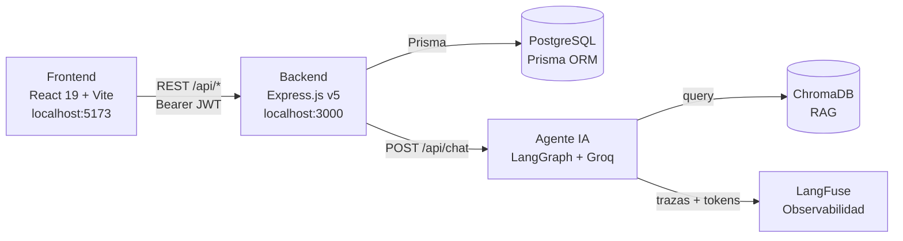
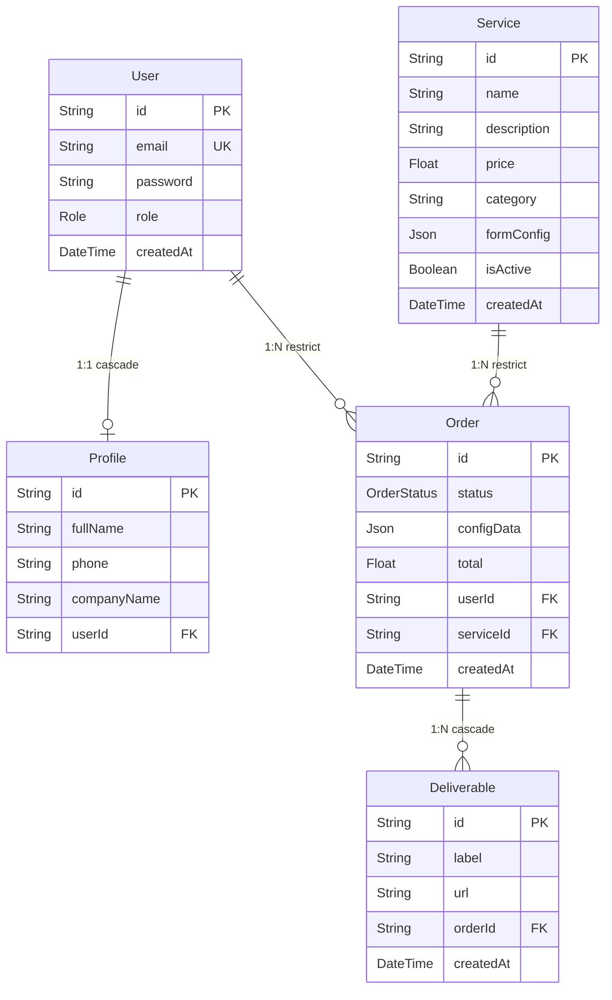
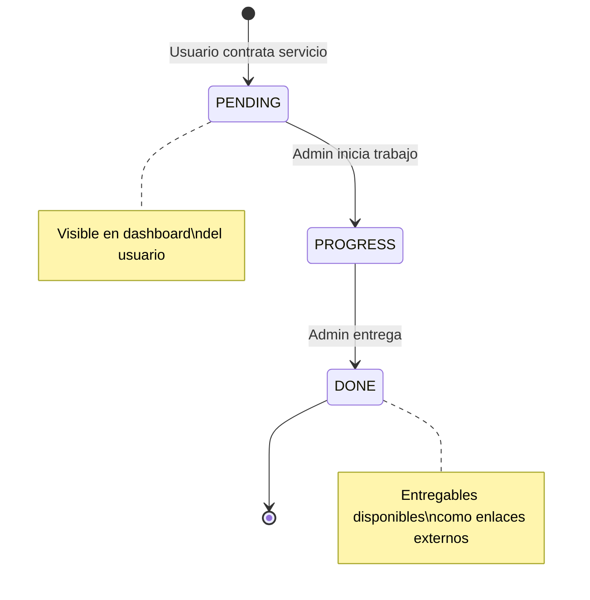
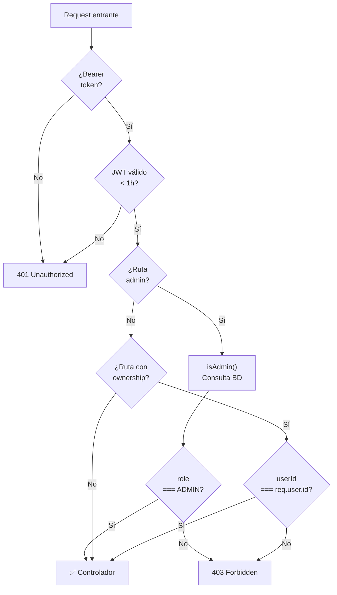

# Swift Studio 360 — Backend API

API REST para **Swift Studio 360**, plataforma B2B de servicios productizados de marketing digital, contenido audiovisual y automatización. Los clientes acceden a un panel privado donde configuran y contratan servicios, hacen seguimiento de sus pedidos y reciben entregables directamente desde el dashboard.

---

## Stack tecnológico

| Capa | Tecnología | Versión |
|---|---|---|
| Framework HTTP | Express.js | v5 |
| Base de datos | PostgreSQL | — |
| ORM | Prisma | v7 |
| Driver DB | @prisma/adapter-pg | — |
| Autenticación | JWT (jsonwebtoken) + bcryptjs | — |
| Validación de inputs | Zod | — |
| Seguridad HTTP | Helmet | — |
| CORS | cors | — |
| Rate limiting | express-rate-limit | — |
| Logger HTTP | Morgan | — |
| Agente IA | LangGraph + Groq (LLaMA 3.1) | — |
| RAG | ChromaDB | — |
| Observabilidad LLM | LangFuse | — |
| Testing | Vitest + Supertest | — |
| Runtime | Node.js (CommonJS) | v18+ |

---

## Arquitectura



---

## Modelo de datos



---

## Estados de un pedido



---

## API Reference

**Base URL:** `http://localhost:3000/api`  
**Autenticación:** `Authorization: Bearer <token>`  
**Formato:** JSON en request y response

### Autenticación

| Método | Ruta | Descripción | Auth | Rate limit |
|---|---|---|---|---|
| POST | `/auth/register` | Registra usuario, devuelve JWT | — | 5 req/h |
| POST | `/auth/login` | Valida credenciales, devuelve JWT | — | 10 req/15min |

### Servicios

| Método | Ruta | Descripción | Auth |
|---|---|---|---|
| GET | `/services` | Lista servicios activos | — |
| GET | `/services/:id` | Detalle de un servicio | — |
| POST | `/services` | Crear servicio | Admin |
| PUT | `/services/:id` | Editar servicio | Admin |
| DELETE | `/services/:id` | Soft delete (`isActive: false`) | Admin |

### Pedidos

| Método | Ruta | Descripción | Auth |
|---|---|---|---|
| POST | `/orders` | Crear pedido | Usuario |
| GET | `/orders` | Listar pedidos (propios / todos si admin) | Usuario |
| GET | `/orders/:id` | Detalle de pedido | Propietario o Admin |
| PUT | `/orders/:id/status` | Cambiar estado | Admin |
| POST | `/orders/:id/deliverables` | Añadir entregable | Admin |
| GET | `/orders/:id/deliverables` | Listar entregables | Propietario o Admin |

### Usuarios

| Método | Ruta | Descripción | Auth |
|---|---|---|---|
| GET | `/users` | Listar todos los usuarios | Admin |
| GET | `/users/:id` | Detalle de usuario | Propio o Admin |
| PUT | `/users/:id` | Actualizar perfil | Propio o Admin |
| DELETE | `/users/:id` | Eliminar usuario | Admin |

### Chat IA

| Método | Ruta | Descripción | Auth | Rate limit |
|---|---|---|---|---|
| POST | `/chat` | Enviar mensaje al agente | Usuario | 30 req/min |
| GET | `/chat/history/:conversationId` | Historial de conversación | Propietario |  |

---

## Control de acceso (RBAC)



**Matriz de permisos por recurso:**

| Recurso | Público | USER | ADMIN |
|---|---|---|---|
| GET `/services` | ✅ | ✅ | ✅ |
| POST/PUT/DELETE `/services` | ❌ | ❌ | ✅ |
| POST `/orders` | ❌ | ✅ | ✅ |
| GET `/orders` | ❌ | Solo propios | Todos |
| GET `/orders/:id` | ❌ | Solo propietario | ✅ |
| PUT `/orders/:id/status` | ❌ | ❌ | ✅ |
| POST `/orders/:id/deliverables` | ❌ | ❌ | ✅ |
| GET `/orders/:id/deliverables` | ❌ | Solo propietario | ✅ |
| GET `/users` | ❌ | ❌ | ✅ |
| GET/PUT `/users/:id` | ❌ | Solo propio | ✅ |
| DELETE `/users/:id` | ❌ | ❌ | ✅ (no puede borrarse a sí mismo) |

---

## Seguridad

### Autenticación y autorización

- **JWT** firmado con HS256, TTL de **1 hora**. Payload: `{ id, email, role }`.
- **bcryptjs** con salt 10 para hashing de contraseñas.
- `isAdmin()` consulta el rol desde la base de datos en cada petición — los cambios de rol son inmediatos.
- Ownership checks en pedidos, entregables e historial de chat: los usuarios solo acceden a sus propios recursos.
- Auto-protección del admin: no puede eliminarse a sí mismo ni escalar su propio rol.

### Validación de inputs

Todos los endpoints que reciben datos usan **schemas Zod** definidos en `*.schema.js`. La validación ocurre antes del controlador a través del middleware `validate()`. Si falla, responde `400 Bad Request` con el primer error descriptivo y el listado completo en `details`. Los datos pasan parseados y saneados al controlador.

URLs de entregables validadas con `z.string().url()` + restricción HTTPS.

### Headers HTTP (Helmet)

| Cabecera | Protección |
|---|---|
| `X-Content-Type-Options: nosniff` | MIME-type sniffing |
| `X-Frame-Options: SAMEORIGIN` | Clickjacking |
| `Strict-Transport-Security` | Fuerza HTTPS en producción |
| `Referrer-Policy` | Fuga de URL en referrer |
| ~~`X-Powered-By`~~ | Eliminada — no revela el stack |

### Rate limiting

| Endpoint | Límite | Ventana |
|---|---|---|
| `POST /auth/login` | 10 req/IP | 15 min |
| `POST /auth/register` | 5 req/IP | 1 hora |
| `POST /chat` | 30 req/IP | 1 min |
| `GET /orders` | 60 req/IP | 15 min |
| `GET /users` | 30 req/IP | 15 min |
| Global (todos los endpoints) | 100 req/IP | 15 min |

### CORS

Configurado con `CORS_ORIGIN` explícito (variable de entorno obligatoria en producción). Si no está definida, el servidor lanza error en el arranque. No existe fallback a `*`.

### Seguridad del agente IA

- Detección de **prompt injection** mediante 14 patrones regex antes de llegar al LLM.
- Validación de la respuesta del LLM con `AgentResponseSchema` (Zod) antes de enviarla al cliente.
- Logs de seguridad con metadatos mínimos (userId, longitud del mensaje, índice de regla) — nunca el contenido completo del mensaje.

### Swagger

La documentación Swagger (`/api/docs`) y Redoc (`/api/redoc`) están **deshabilitadas en producción** (`NODE_ENV === 'production'`).

---

## Tests

Suite de **14 tests de integración** en `tests/api.test.js` con Vitest + Supertest, contra la base de datos real (sin mocks).

| # | Descripción | Resultado esperado |
|---|---|---|
| 1 | Registro exitoso | `201` + token + `role: USER` |
| 2 | Email duplicado | `409 Conflict` |
| 3 | Login correcto | `200` + token sin campo `password` |
| 4 | Contraseña incorrecta | `401 Unauthorized` |
| 5 | Listado público de servicios | `200` + todos `isActive: true` |
| 6 | Admin crea servicio | `201` con token admin |
| 7 | Usuario bloqueado en ruta admin | `403 Forbidden` |
| 8 | Usuario crea pedido | `201` + `total` calculado desde el servicio |
| 9 | Ownership en listado de pedidos | Solo pedidos del usuario autenticado |
| 10 | Cambio de estado — USER bloqueado | `403 Forbidden` |
| 11 | Cambio de estado — Admin | `200` + estado actualizado |
| 12 | Chat sin autenticación | `401 Unauthorized` |
| 13 | Chat con token válido | `200` + respuesta del agente |
| 14 | Historial — acceso de otro usuario | `403 Forbidden` |

Los tests generan usuarios únicos con timestamp en cada ejecución y limpian todos los datos en `afterAll`.

---

## Puesta en marcha

Requisitos: Node.js v18+, PostgreSQL en ejecución.

```bash
cp .env.example .env        # configurar credenciales
npm install
npx prisma generate
npx prisma migrate dev --name init
npx prisma db seed
npm run dev                 # → http://localhost:3000
npm test                    # suite de integración
```

### Variables de entorno

| Variable | Descripción |
|---|---|
| `DATABASE_URL` | Connection string PostgreSQL |
| `JWT_SECRET` | Mínimo 32 caracteres (`openssl rand -hex 32`) |
| `PORT` | Puerto del servidor (default: 3000) |
| `CORS_ORIGIN` | URL exacta del frontend (obligatoria en producción) |
| `GROQ_API_KEY` | Clave de API de Groq (agente IA) |
| `CHROMA_HOST` / `CHROMA_PORT` | Conexión a ChromaDB |
| `LANGFUSE_SECRET_KEY` / `LANGFUSE_PUBLIC_KEY` | Observabilidad LLM |
| `NODE_ENV` | `production` en despliegue (activa morgan combined, deshabilita Swagger) |

---

## Despliegue (Render)

El backend sirve también el frontend compilado desde `backend/public/` como archivos estáticos, actuando como servidor único en producción.

| Campo | Valor |
|---|---|
| Root Directory | `backend` |
| Build Command | `npm ci --include=dev && npx prisma generate` |
| Start Command | `npx prisma migrate deploy && node src/server.js` |

`PORT` lo inyecta Render automáticamente. `CORS_ORIGIN` debe apuntar a la URL del frontend desplegado en Netlify/Vercel.

---

## Estructura del proyecto

```
backend/
├── prisma/
│   ├── schema.prisma          # Modelos, relaciones y enums
│   ├── seed.js                # Catálogo inicial de servicios
│   └── migrations/
├── src/
│   ├── features/
│   │   ├── auth/              # register · login
│   │   ├── users/             # CRUD usuarios + perfil
│   │   ├── services/          # CRUD servicios
│   │   ├── orders/            # pedidos + entregables
│   │   └── chat/              # agente IA + historial
│   ├── middlewares/
│   │   ├── auth.middleware.js         # authenticate · isAdmin (con consulta BD)
│   │   ├── validate.middleware.js     # validate(schema) → Zod
│   │   ├── promptSecurity.middleware.js  # detección prompt injection
│   │   └── error.middleware.js        # manejador centralizado de errores
│   ├── lib/
│   │   ├── prisma.js           # singleton PrismaClient
│   │   └── asyncHandler.js     # wrapper async → next(err)
│   ├── config/
│   │   └── swagger.js          # spec OpenAPI (deshabilitado en producción)
│   ├── app.js                  # middlewares globales + rutas
│   └── server.js               # arranque del servidor
└── tests/
    └── api.test.js             # 14 tests de integración
```
