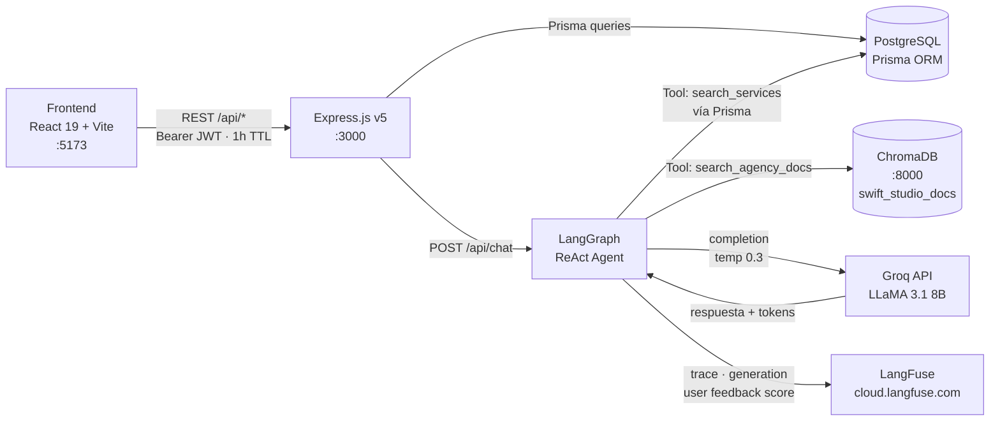
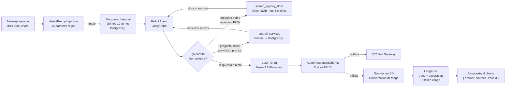
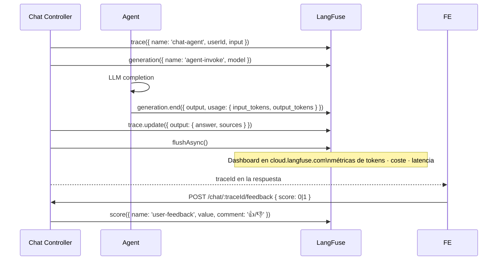
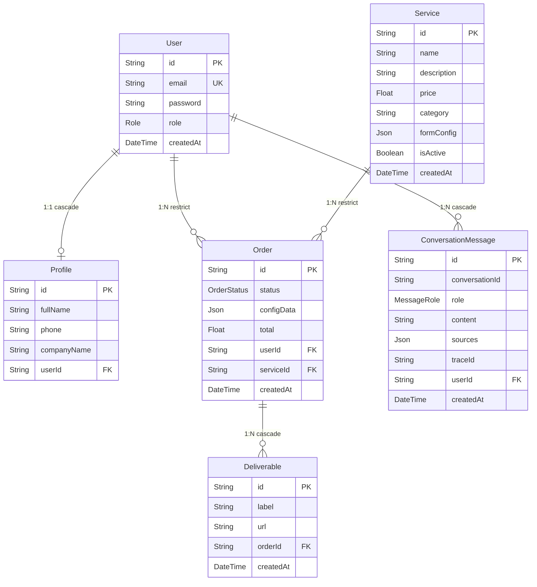
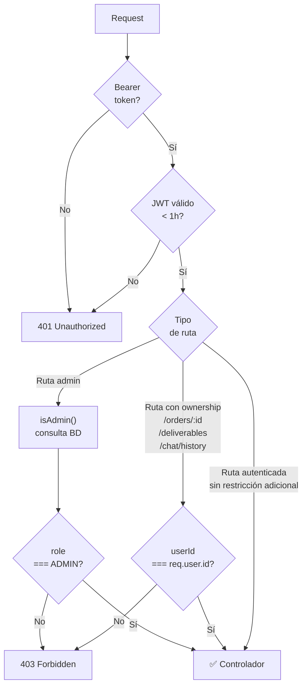

# Swift Studio 360 — Backend API

API REST para **Swift Studio 360**, plataforma B2B privada de contratación de servicios de marketing digital. Integra autenticación JWT con RBAC, gestión de pedidos y entregables, un agente IA conversacional basado en LangGraph con RAG sobre ChromaDB, y observabilidad completa del LLM con LangFuse.

---

## Stack tecnológico

### Core

| Capa | Tecnología | Versión |
|---|---|---|
| Framework HTTP | Express.js | v5 |
| Runtime | Node.js (CommonJS) | v18+ |
| Base de datos | PostgreSQL | — |
| ORM | Prisma | v7 |
| Driver DB | @prisma/adapter-pg | — |
| Autenticación | JWT (jsonwebtoken) + bcryptjs | — |
| Validación de inputs | Zod | — |
| Seguridad HTTP | Helmet | — |
| CORS | cors | — |
| Rate limiting | express-rate-limit | — |
| Logger HTTP | Morgan | — |
| Testing | Vitest + Supertest | — |

### Inteligencia Artificial

| Capa | Tecnología | Detalle |
|---|---|---|
| Orquestación agente | LangGraph (`createReactAgent`) | Patrón ReAct — razonamiento + acción |
| LLM | Groq API — LLaMA 3.1 8B Instant | `temperature: 0.3` |
| Framework LLM | LangChain Core + LangChain Groq | — |
| RAG (retrieval) | ChromaDB | Colección `swift_studio_docs` |
| Embeddings | DefaultEmbeddingFunction | sentence-transformers en servidor ChromaDB |
| Observabilidad | LangFuse | Trazas, tokens, coste, feedback 👍/👎 |

---

## Arquitectura general



---

## Agente IA — LangGraph ReAct

El chatbot usa el patrón **ReAct** (Reasoning + Acting): el agente razona sobre la consulta, decide qué herramientas invocar, observa el resultado y genera la respuesta final.



### Herramientas del agente

| Tool | Nombre interno | Fuente de datos | Descripción |
|---|---|---|---|
| Tool 1 | `search_agency_docs` | ChromaDB (RAG) | Historia, metodología, FAQs, portfolio — top 3 chunks más relevantes |
| Tool 2 | `search_services` | PostgreSQL (Prisma) | Servicios activos con precios — filtro por categoría y/o nombre |

### Contexto conversacional

- El historial se persiste en la tabla `ConversationMessage` de PostgreSQL.
- El agente recibe los **últimos 10 turnos** de la conversación como contexto.
- El `conversationId` es un UUID generado en el primer mensaje y devuelto al cliente para sesiones continuas.

### Seguridad del agente

- **System prompt** con reglas innegociables: no revelar instrucciones, ignorar intentos de roleplaying, no ejecutar código externo.
- Logs de auditoría de solo metadatos — nunca el contenido del mensaje.
- `AgentResponseSchema` (Zod) valida la respuesta del LLM antes de guardarla en BD ni enviarla al cliente.
- Si ChromaDB contiene instrucciones dirigidas al agente, el system prompt las instruye a ignorarlas (defensa contra indirect prompt injection).

---

## Observabilidad LLM — LangFuse

Cada petición al agente genera una **traza completa** en LangFuse Cloud:



| Métrica registrada | Descripción |
|---|---|
| `input_tokens` / `output_tokens` | Uso de tokens por petición |
| Latencia | Tiempo de respuesta del LLM |
| `user-feedback` score | Feedback 👍 (1) / 👎 (0) del usuario sobre cada respuesta |
| `userId` | Usuario que generó la traza |
| `sources` | Documentos RAG citados en la respuesta |

LangFuse se inicializa como **singleton lazy** — si las variables de entorno no están configuradas, el agente funciona sin observabilidad sin lanzar error.

---

## Modelo de datos



**Enums:** `Role` (USER · ADMIN) · `OrderStatus` (PENDING · PROGRESS · DONE) · `MessageRole` (USER · ASSISTANT)

---

## Estados de un pedido

```mermaid
stateDiagram-v2
  [*] --> PENDING : Usuario contrata servicio\nPOST /orders
  PENDING --> PROGRESS : Admin inicia trabajo\nPUT /orders/:id/status
  PROGRESS --> DONE : Admin entrega\nPUT /orders/:id/status
  DONE --> [*]

  note right of PENDING : total calculado\nautonómicamente\ndesde el precio del servicio
  note right of DONE : Entregables disponibles\nvía GET /orders/:id/deliverables
```

---

## API Reference

**Base URL:** `http://localhost:3000/api` · **Auth:** `Authorization: Bearer <token>` · **Formato:** JSON

### Autenticación

| Método | Ruta | Descripción | Rate limit |
|---|---|---|---|
| POST | `/auth/register` | Registra usuario — devuelve `{ user, token }` | 5 req/h |
| POST | `/auth/login` | Valida credenciales — devuelve `{ user, token }` | 10 req/15min |

### Servicios

| Método | Ruta | Descripción | Auth |
|---|---|---|---|
| GET | `/services` | Lista servicios activos (`isActive: true`) | — |
| GET | `/services/:id` | Detalle de servicio | — |
| POST | `/services` | Crear servicio | Admin |
| PUT | `/services/:id` | Editar servicio (parcial) | Admin |
| DELETE | `/services/:id` | Soft delete → `isActive: false` | Admin |

### Pedidos

| Método | Ruta | Descripción | Auth | Rate limit |
|---|---|---|---|---|
| POST | `/orders` | Crear pedido (`total` auto desde servicio) | Usuario | 20 req/15min |
| GET | `/orders` | Admin: todos. Usuario: propios | Usuario | 60 req/15min |
| GET | `/orders/:id` | Detalle (propietario u Admin) | Usuario | — |
| PUT | `/orders/:id/status` | Cambiar estado | Admin | — |
| POST | `/orders/:id/deliverables` | Añadir entregable (URL HTTPS) | Admin | — |
| GET | `/orders/:id/deliverables` | Listar entregables | Propietario o Admin | — |

### Usuarios

| Método | Ruta | Descripción | Auth | Rate limit |
|---|---|---|---|---|
| GET | `/users` | Listar todos | Admin | 30 req/15min |
| GET | `/users/:id` | Detalle (propio o Admin) | Usuario | — |
| PUT | `/users/:id` | Actualizar perfil (propio o Admin) | Usuario | — |
| DELETE | `/users/:id` | Eliminar (Admin, no puede borrarse a sí mismo) | Admin | — |

### Chat IA

| Método | Ruta | Descripción | Auth | Rate limit |
|---|---|---|---|---|
| POST | `/chat` | Enviar mensaje al agente | Usuario | 30 req/min |
| GET | `/chat/history/:conversationId` | Historial de conversación (propietario) | Usuario | — |
| POST | `/chat/:traceId/feedback` | Feedback 👍/👎 sobre respuesta | Usuario | — |

---

## Control de acceso (RBAC)



**Matriz de permisos:**

| Recurso | Público | USER | ADMIN |
|---|---|---|---|
| GET `/services` | ✅ | ✅ | ✅ |
| POST/PUT/DELETE `/services` | ❌ | ❌ | ✅ |
| POST `/orders` | ❌ | ✅ | ✅ |
| GET `/orders` | ❌ | Solo propios | Todos |
| GET `/orders/:id` | ❌ | Solo propietario | ✅ |
| PUT `/orders/:id/status` | ❌ | ❌ | ✅ |
| POST `/orders/:id/deliverables` | ❌ | ❌ | ✅ |
| GET `/orders/:id/deliverables` | ❌ | Solo propietario | ✅ |
| GET `/users` | ❌ | ❌ | ✅ |
| GET/PUT `/users/:id` | ❌ | Solo propio | ✅ |
| DELETE `/users/:id` | ❌ | ❌ | ✅ (no self) |
| POST `/chat` | ❌ | ✅ | ✅ |
| GET `/chat/history/:id` | ❌ | Solo propietario | ✅ |

---

## Seguridad

### Autenticación y autorización

- **JWT** firmado con HS256, TTL **1 hora**. Payload: `{ id, email, role }`.
- **bcryptjs** salt 10 para hashing de contraseñas — protección contra fuerza bruta offline.
- `isAdmin()` consulta el rol desde BD en cada petición — los cambios de rol son inmediatos sin esperar expiración de token.
- Ownership checks en pedidos, entregables y conversaciones — los usuarios solo acceden a sus propios recursos.
- Auto-protección: admin no puede eliminarse ni escalar su propio rol.

### Validación de inputs (Zod)

Todos los endpoints con body usan schemas Zod en `*.schema.js`. La validación ocurre en el middleware `validate()` antes del controlador. Si falla → `400 Bad Request` con mensaje descriptivo. Los datos entran al controlador ya parseados y tipados.

URLs de entregables validadas con `.url()` + `.refine(url => url.startsWith('https://'))`.

La respuesta del LLM también es validada con `AgentResponseSchema` antes de persistirse o enviarse al cliente (OWASP API10 — Unsafe Consumption of APIs).

### Headers HTTP (Helmet)

| Cabecera | Protección |
|---|---|
| `X-Content-Type-Options: nosniff` | MIME sniffing |
| `X-Frame-Options: SAMEORIGIN` | Clickjacking |
| `Strict-Transport-Security` | Fuerza HTTPS |
| `Referrer-Policy` | Fuga de URL |
| ~~`X-Powered-By`~~ | Eliminada — no revela stack |

### Rate limiting

| Endpoint | Límite | Ventana |
|---|---|---|
| `POST /auth/login` | 10 req/IP | 15 min |
| `POST /auth/register` | 5 req/IP | 1 hora |
| `POST /chat` | 30 req/IP | 1 min |
| `POST /orders` | 20 req/IP | 15 min |
| `GET /orders` | 60 req/IP | 15 min |
| `GET /users` | 30 req/IP | 15 min |
| Global (todos los endpoints) | 100 req/IP | 15 min |

### CORS

`CORS_ORIGIN` es obligatoria en producción — si no está definida, el servidor lanza error en el arranque. Sin fallback a `*`.

### Agente IA

- 14 patrones regex de detección de prompt injection antes de llegar al LLM.
- System prompt con reglas de seguridad innegociables (anti-jailbreak, anti-roleplaying).
- Defensa contra indirect prompt injection: el agente ignora instrucciones dentro de documentos RAG.
- Logs de solo metadatos (userId, longitud, índice de regla) — nunca el contenido del mensaje.

### Swagger

`/api/docs` y `/api/redoc` deshabilitados cuando `NODE_ENV === 'production'`.

### Manejo de errores

`asyncHandler` elimina los try/catch manuales en controladores — propaga errores a `errorHandler`. Los errores 5xx devuelven siempre `"Internal server error"` genérico; los errores de negocio (4xx) devuelven el mensaje descriptivo del controlador.

| Error | HTTP |
|---|---|
| JSON malformado | 400 |
| Fallo de validación Zod | 400 |
| JWT inválido / expirado | 401 |
| Sin permisos de acceso | 403 |
| Recurso no encontrado | 404 |
| Unique constraint (ej. email duplicado) | 409 |
| FK constraint | 409 |
| Respuesta LLM inválida | 502 |
| Error inesperado | 500 |

---

## Tests

14 tests de integración en `tests/api.test.js` — Vitest + Supertest contra la base de datos real (sin mocks).

| # | Descripción | Resultado esperado |
|---|---|---|
| 1 | Registro exitoso | `201` + token + `role: USER` |
| 2 | Email duplicado | `409 Conflict` |
| 3 | Login correcto | `200` + token, sin campo `password` |
| 4 | Contraseña incorrecta | `401 Unauthorized` |
| 5 | Listado público de servicios | `200` + todos `isActive: true` |
| 6 | Admin crea servicio | `201` con token admin |
| 7 | Usuario bloqueado en ruta admin | `403 Forbidden` |
| 8 | Usuario crea pedido | `201` + `total` calculado |
| 9 | Ownership en listado de pedidos | Solo pedidos del usuario autenticado |
| 10 | Cambio de estado — USER bloqueado | `403 Forbidden` |
| 11 | Cambio de estado — Admin | `200` + estado actualizado |
| 12 | Chat sin autenticación | `401 Unauthorized` |
| 13 | Chat con token válido | `200` + respuesta del agente |
| 14 | Historial de otro usuario | `403 Forbidden` |

Usuarios generados con timestamp único por ejecución — `afterAll` limpia todos los datos generados.

---

## Puesta en marcha

**Requisitos:** Node.js v18+, PostgreSQL, ChromaDB corriendo en `localhost:8000`.

```bash
cp .env.example .env        # configurar credenciales
npm install
npx prisma generate
npx prisma migrate dev --name init
npx prisma db seed          # catálogo inicial de servicios
npm run dev                 # → http://localhost:3000
npm test                    # suite de integración
npx prisma studio           # explorador visual de la BD
```

### Variables de entorno

| Variable | Descripción | Requerida |
|---|---|---|
| `DATABASE_URL` | Connection string PostgreSQL | ✅ |
| `JWT_SECRET` | Mínimo 32 chars — `openssl rand -hex 32` | ✅ |
| `PORT` | Puerto del servidor (default: 3000) | — |
| `CORS_ORIGIN` | URL exacta del frontend — obligatoria en producción | ✅ prod |
| `NODE_ENV` | `production` activa morgan combined y deshabilita Swagger | ✅ prod |
| `GROQ_API_KEY` | Clave Groq para el LLM | ✅ IA |
| `GROQ_MODEL` | Modelo Groq (default: `llama-3.1-8b-instant`) | — |
| `CHROMA_HOST` | Host del servidor ChromaDB (default: `localhost`) | ✅ IA |
| `CHROMA_PORT` | Puerto ChromaDB (default: `8000`) | — |
| `LANGFUSE_SECRET_KEY` | Clave privada LangFuse | ✅ obs |
| `LANGFUSE_PUBLIC_KEY` | Clave pública LangFuse | ✅ obs |
| `LANGFUSE_HOST` | Host LangFuse (default: `https://cloud.langfuse.com`) | — |

> Si `GROQ_API_KEY` no está definida, el agente responde con un mensaje de error controlado sin romper la app. Si las claves de LangFuse no están definidas, la observabilidad se desactiva silenciosamente.

---

## Despliegue (Render)

El backend sirve también el frontend compilado desde `backend/public/` como archivos estáticos, actuando como servidor único en producción.

| Campo | Valor |
|---|---|
| Root Directory | `backend` |
| Build Command | `npm ci --include=dev && npx prisma generate` |
| Start Command | `npx prisma migrate deploy && node src/server.js` |

`PORT` lo inyecta Render automáticamente. Definir todas las variables de entorno marcadas como `✅ prod` en el panel de Render antes del primer despliegue.

---

## Estructura del proyecto

```
backend/
├── prisma/
│   ├── schema.prisma          # 6 modelos · 3 enums · relaciones
│   ├── seed.js                # Catálogo inicial de servicios
│   └── migrations/
├── src/
│   ├── features/
│   │   ├── auth/              # register · login · schemas · rate limiters
│   │   ├── users/             # CRUD usuarios + perfil (upsert)
│   │   ├── services/          # CRUD servicios + soft delete
│   │   ├── orders/            # pedidos + entregables + ownership
│   │   └── chat/
│   │       ├── chat.controller.js    # sendMessage · getChatHistory · submitFeedback
│   │       ├── chat.routes.js        # auth → rateLimit → validate → promptSecurity
│   │       ├── chat.schema.js        # SendMessageSchema · FeedbackSchema · AgentResponseSchema
│   │       └── agent/
│   │           ├── agent.js          # createReactAgent · LangFuse tracing · buildMessages
│   │           └── tools.js          # search_agency_docs (ChromaDB) · search_services (Prisma)
│   ├── middlewares/
│   │   ├── auth.middleware.js         # authenticate · isAdmin (consulta BD)
│   │   ├── validate.middleware.js     # validate(schema) → Zod
│   │   ├── promptSecurity.middleware.js  # 14 patrones regex anti-injection
│   │   └── error.middleware.js        # Prisma errors · 5xx genéricos
│   ├── lib/
│   │   ├── prisma.js           # singleton PrismaClient
│   │   ├── asyncHandler.js     # wrapper async → next(err)
│   │   ├── chroma.js           # singleton ChromaClient · getCollection · searchDocs
│   │   └── langfuse.js         # singleton lazy Langfuse · null si sin credenciales
│   ├── config/
│   │   └── swagger.js          # spec OpenAPI (solo en development)
│   ├── app.js                  # middlewares globales · rutas · static files
│   └── server.js               # arranque del servidor
└── tests/
    └── api.test.js             # 14 tests de integración
```
