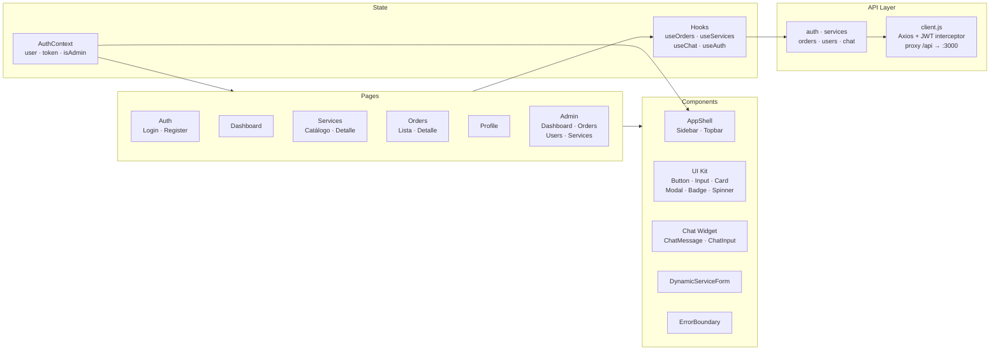
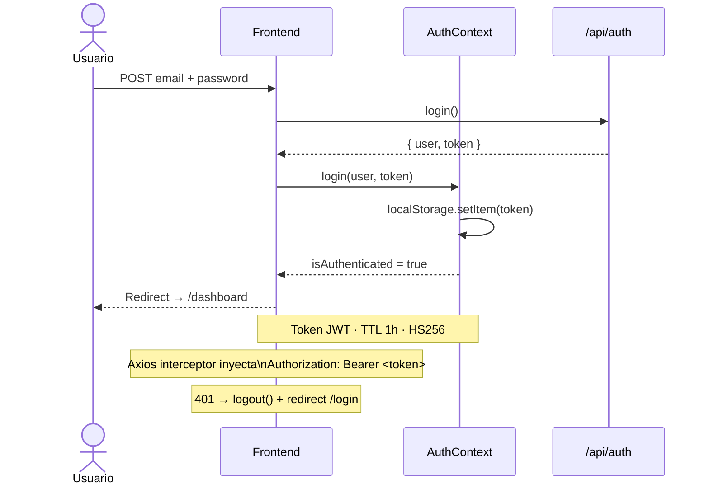
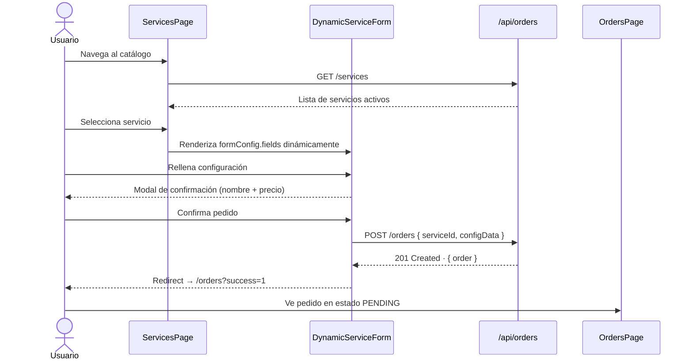
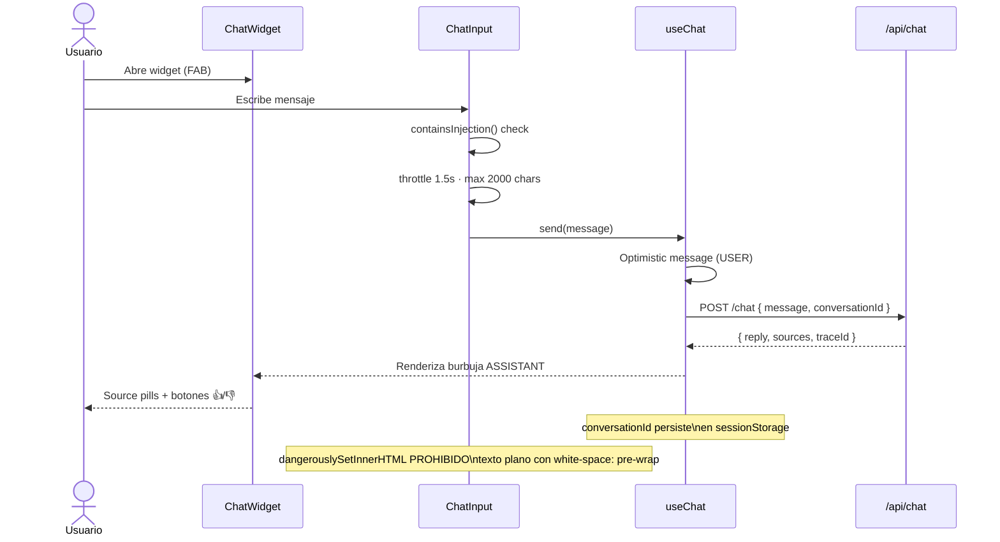

# Swift Studio 360 — Frontend

Interfaz de cliente para **Swift Studio 360**, plataforma B2B privada de contratación de servicios de marketing digital. Acceso exclusivo mediante autenticación — no indexable públicamente. Incluye catálogo de servicios con formularios dinámicos, panel de pedidos, perfil, chat con agente IA y panel de administración completo.

---

## Stack tecnológico

| Capa | Tecnología | Versión |
|---|---|---|
| UI Library | React | v19 |
| Bundler | Vite | v8 |
| Routing | React Router DOM | v7 |
| Estado global | Context API (AuthContext) | — |
| HTTP client | Axios (interceptores JWT) | v1 |
| Sanitización HTML | DOMPurify | v3 |
| Utilidades CSS | clsx | v2 |
| Formateo de fechas | date-fns | v4 |
| Estilos | CSS Modules + CSS Custom Properties | — |
| Tipografías | Space Grotesk · Inter · JetBrains Mono | Google Fonts |

---

## Arquitectura



---

## Flujo de autenticación



---

## Flujo de compra



---

## Flujo del chatbot IA



---

## Páginas

| Ruta | Componente | Acceso | Descripción |
|---|---|---|---|
| `/login` | `LoginPage` | Público | Split-panel con formulario de acceso |
| `/register` | `RegisterPage` | Público | Registro con password strength indicator |
| `/dashboard` | `DashboardPage` | Usuario | Resumen de pedidos y acceso rápido |
| `/services` | `ServicesPage` | Usuario | Catálogo filtrable por categoría |
| `/services/:id` | `ServiceDetailPage` | Usuario | Detalle + formulario dinámico de contratación |
| `/orders` | `OrdersPage` | Usuario | Lista de pedidos con badges de estado |
| `/orders/:id` | `OrderDetailPage` | Usuario | Stepper PENDING→PROGRESS→DONE + entregables |
| `/profile` | `ProfilePage` | Usuario | Edición de datos personales y empresa |
| `/admin` | `AdminDashboardPage` | Admin | Estadísticas y últimos pedidos |
| `/admin/orders` | `AdminOrdersPage` | Admin | Gestión de todos los pedidos + entregables |
| `/admin/users` | `AdminUsersPage` | Admin | Listado y eliminación de usuarios |
| `/admin/services` | `AdminServicesPage` | Admin | CRUD completo del catálogo |

Todas las rutas `/dashboard` en adelante requieren token válido. Las rutas `/admin/*` requieren además `role === ADMIN`. La comprobación se realiza en `ProtectedRoute` antes del render.

---

## Design System

Paleta **light mode** definida como CSS Custom Properties en `src/styles/tokens.css` — fuente única de verdad consumida por todos los CSS Modules.

| Token | Valor | Uso |
|---|---|---|
| `--color-brand` | `#8A52F7` | Malva — CTA, estados activos, focus |
| `--color-brand-2` | `#FE8C7C` | Coral — highlights, hover, accentos |
| `--gradient-brand` | coral → malva | Botones premium, avatares, headings |
| `--color-bg` | `#F4F4F9` | Fondo base de la aplicación |
| `--color-surface` | `#FFFFFF` | Cards, paneles |
| `--color-text` | `#16161E` | Texto principal |
| `--color-success` | `#0FD39E` | Badge DONE |
| `--color-warning` | `#FDB863` | Badge PROGRESS |
| `--color-error` | `#EF4765` | Badge PENDING, errores |

**Tipografía:** Space Grotesk (headings) · Inter (body) · JetBrains Mono (chat, código)  
**Escala de espaciado:** base 4px (`--space-1` → `--space-24`)  
**Radios:** `8px` sm → `9999px` full  
**Transiciones:** `fast 140ms` · `base 280ms` · `slow 520ms` — todas con `cubic-bezier(0.22, 0.61, 0.36, 1)`

---

## Componentes UI (Design System)

| Componente | Variantes / Props clave |
|---|---|
| `Button` | `variant`: primary · secondary · ghost · danger; `size`: sm · md · lg; shimmer en hover |
| `Input` | `label`, `error`, `type`; glow en focus con `--color-brand` |
| `Card` | Superficie elevada con `--shadow-md`; hover lift opcional |
| `Badge` | `status`: PENDING · PROGRESS · DONE; pulse animation en PROGRESS |
| `Modal` | Portal React; `role="dialog"` + `aria-labelledby`; cierra con Escape y click en overlay |
| `Spinner` | Tamaño configurable; color brand |
| `EmptyState` | Ilustración + copy + CTA opcional |
| `ErrorBoundary` | Class component; captura errores de render; botones reset + reload |

---

## Seguridad

### Autenticación en cliente

- Token JWT almacenado en `localStorage` (expiración 1h, limpiado en logout).
- `ProtectedRoute` evalúa `isAuthenticated` y `isAdmin` antes de renderizar cualquier ruta privada.
- Axios interceptor inyecta `Authorization: Bearer <token>` en cada petición automáticamente.
- Respuesta `401` del servidor → `logout()` + redirect a `/login` sin intervención manual.

### XSS

- `dangerouslySetInnerHTML` **prohibido** en todo el proyecto. Todo el contenido dinámico se renderiza como texto plano mediante JSX (escape automático de React).
- Respuestas del agente IA mostradas con `white-space: pre-wrap` — nunca como HTML.
- DOMPurify disponible en `utils/sanitize.js` para casos excepcionales que requieran HTML.

### Prompt injection (chat)

- `containsInjection()` en `ChatInput` detecta patrones de jailbreaking antes del envío.
- Si se detecta, se muestra un warning al usuario y se limpia el input sin enviar.
- Throttle de **1.5 segundos** entre mensajes para prevenir flooding.
- Límite de **2000 caracteres** por mensaje, alineado con la validación del backend.

### Plataforma privada

- `robots.txt` con `Disallow: /` — ningún motor de búsqueda indexa la aplicación.
- `<meta name="robots" content="noindex, nofollow">` en `index.html` como segunda capa.
- Proxy Vite en desarrollo (`/api → localhost:3000`) — la URL del backend nunca se expone al cliente en producción.

### Robustez

- `ErrorBoundary` envuelve toda la aplicación — ningún stack trace llega al usuario final en producción.
- Mensajes de error al usuario siempre genéricos — no revelan detalles del backend.

---

## Estructura del proyecto

```
frontend/src/
├── api/
│   ├── client.js           # Axios + interceptor JWT + redirect 401
│   ├── auth.api.js
│   ├── services.api.js
│   ├── orders.api.js
│   ├── users.api.js
│   └── chat.api.js
├── config/
│   └── content.js          # White-label: toda la copia de marca en un solo archivo
├── context/
│   └── AuthContext.jsx      # user · token · login · logout · isAdmin · isAuthenticated
├── hooks/
│   ├── useAuth.js
│   ├── useServices.js
│   ├── useOrders.js
│   └── useChat.js
├── pages/                   # Cada página con su .module.css co-localizado
│   ├── Auth/
│   ├── Dashboard/
│   ├── Services/
│   ├── Orders/
│   ├── Profile/
│   └── Admin/
├── components/
│   ├── layout/
│   │   ├── AppShell.jsx     # Sidebar + Topbar + <Outlet />
│   │   ├── Sidebar.jsx      # Nav links activos, sección admin, logout
│   │   ├── Topbar.jsx       # Título dinámico por ruta, hamburger móvil
│   │   └── ProtectedRoute.jsx
│   ├── ui/                  # Button · Input · Card · Badge · Spinner · Modal · EmptyState · ErrorBoundary
│   ├── chat/                # ChatWidget · ChatMessage · ChatInput
│   └── forms/
│       └── DynamicServiceForm.jsx  # Renderiza formConfig.fields del backend
├── utils/
│   ├── validators.js        # Validación de formularios (email, password, required)
│   ├── formatters.js        # formatPrice(€) · formatDate
│   └── sanitize.js          # DOMPurify wrapper + containsInjection()
├── styles/
│   ├── tokens.css           # CSS Custom Properties globales (design tokens)
│   └── global.css           # Reset + tipografía base
├── router.jsx               # Rutas lazy con Suspense + ProtectedRoute
├── App.jsx                  # ErrorBoundary → AuthProvider → RouterProvider
└── main.jsx                 # StrictMode + imports globales de estilos
```

---

## Puesta en marcha

Requisito: backend corriendo en `http://localhost:3000`.

```bash
npm install
npm run dev     # → http://localhost:5173
npm run build   # build de producción en dist/
```

El proxy de Vite redirige `/api/*` al backend automáticamente en desarrollo. No se necesita ninguna variable de entorno adicional.

---

## Despliegue (Netlify / Vercel)

El frontend se despliega como SPA estática desde la carpeta `frontend/`.

| Campo | Valor |
|---|---|
| Build Command | `npm run build` |
| Publish Directory | `dist` |
| Node Version | 18+ |

Añadir regla de rewrite para que React Router funcione correctamente:

- **Netlify** — archivo `public/_redirects`: `/* /index.html 200`
- **Vercel** — campo `rewrites` en `vercel.json`: `{ "source": "/(.*)", "destination": "/index.html" }`
